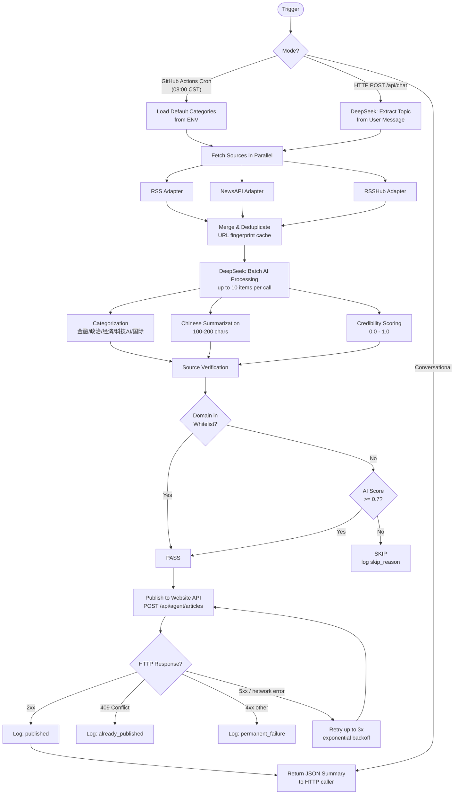

# Daily Info Agent — Product Requirements Document

**Version**: 1.0  
**Date**: 2026-05-29  
**Status**: Draft  
**Author**: Product Team  
**Module**: `github.com/user/daily-info-agent`

---

## 1. Project Background & Goals

### Background

Information overload is a persistent problem for individuals who need to stay informed across multiple domains — finance, politics, economics, technology, and international affairs — in both Chinese and English media. Manually aggregating and reading raw feeds is time-consuming and produces low signal-to-noise output. This project automates the full pipeline: fetch → process → verify → publish, delivering a curated, AI-summarized digest to a personal website every morning, and responding to ad-hoc curiosity throughout the day via a conversational API.

### Problem Statement

- Raw RSS/news feeds contain hundreds of items daily; most are low-value or duplicate
- No single source covers all required categories in Chinese
- Verifying source credibility manually is impractical at scale
- Publishing formatted articles to a personal site requires a repeatable, automated workflow

### Goals (v1)

| Goal | Target |
|------|--------|
| Deliver a daily digest to the website every morning | By 08:15 CST daily |
| Process at least 200 news items per scheduled run | With < 5% missed publishes due to system error |
| Provide on-demand conversational fetch | Response within 30 seconds for a single-topic query |
| Enforce source credibility filtering | Zero items published with AI score < 0.7 AND not on whitelist |

### Success Metrics

- **Coverage**: >= 3 published articles per category per scheduled run
- **Reliability**: >= 99% of scheduled GitHub Actions runs complete without a fatal error
- **Quality**: AI credibility score average >= 0.75 across published items
- **Latency**: Conversational API P95 response time <= 30 seconds
- **Deduplication**: < 2% duplicate articles published in a rolling 7-day window

---

## 2. User Stories

### P0 — Must-Have

| ID | Story | Value |
|----|-------|-------|
| US-001 | As a **site owner**, I want a daily digest of categorized news automatically published to my website at 8am CST so that I can read a curated briefing without manual effort. | Saves 30–60 min/day of manual aggregation |
| US-002 | As a **site owner**, I want each published article to include a concise Chinese summary so that I can quickly understand the gist without reading the full source. |  High information density |
| US-003 | As a **site owner**, I want source credibility enforced before publishing so that low-quality or unreliable content never appears on my site. | Protects site reputation |
| US-004 | As a **site owner**, I want the agent to POST new articles to my website API so that content appears on my site without manual copy-paste. | Full automation of the last mile |
| US-005 | As a **site owner**, I want the system to retry failed API calls so that transient network errors do not silently drop articles. | Reliability |
| US-006 | As a **developer**, I want all secrets (API keys, tokens) stored as environment variables and never logged so that credentials are not leaked. | Security baseline |

### P1 — Should-Have

| ID | Story | Value |
|----|-------|-------|
| US-007 | As a **site visitor**, I want to send a chat message asking about a specific topic and receive a fresh, AI-summarized response so that I can get on-demand news without browsing. | Conversational UX |
| US-008 | As a **developer**, I want structured JSON logs for every pipeline step so that I can debug failures quickly. | Observability |
| US-009 | As a **site owner**, I want the default categories (Finance, Politics, Economy, Tech/AI, International) configurable via environment variables so that I can adjust scope without code changes. | Operational flexibility |
| US-010 | As a **developer**, I want deduplication across runs so that the same article is not published twice within a 7-day window. | Content quality |

### P2 — Nice-to-Have

| ID | Story | Value |
|----|-------|-------|
| US-011 | As a **site owner**, I want the conversational API to maintain a short session context so that follow-up questions can refine the previous query. | Better UX |
| US-012 | As a **developer**, I want Prometheus-compatible metrics exposed on a `/metrics` endpoint so that I can monitor pipeline health in a dashboard. | Advanced observability |
| US-013 | As a **site owner**, I want WeChat public account articles fetched via RSSHub so that Chinese-language social media content is included. | Source diversity |

---

## 3. Functional Requirements

### FR-Scheduled: Daily Scheduled Execution

| ID | Requirement | Acceptance Criteria |
|----|-------------|---------------------|
| FR-SCH-001 | The service MUST be triggerable via a GitHub Actions cron job at 08:00 CST (01:00 UTC) daily. | GitHub Actions workflow file present; cron expression `0 1 * * *`; job completes exit 0 on success. |
| FR-SCH-002 | On scheduled trigger, the agent MUST fetch all configured default categories. | All 5 categories (Finance, Politics, Economy, Tech/AI, International) are processed in a single run unless explicitly disabled. |
| FR-SCH-003 | Default categories MUST be configurable via the environment variable `DEFAULT_CATEGORIES` (comma-separated). | Changing `DEFAULT_CATEGORIES=tech,finance` and re-running processes only those two categories. |
| FR-SCH-004 | The scheduled run MUST complete all fetching, processing, verification, and publishing within 15 minutes. | GitHub Actions run wall-clock time <= 15 min under normal load. |
| FR-SCH-005 | The agent MUST deduplicate articles within a 7-day rolling window using a URL-based fingerprint stored in a local cache file (or GitHub Actions cache). | Re-running the same day's job does not re-publish already-published URLs. |

### FR-Conversational: On-Demand HTTP API

| ID | Requirement | Acceptance Criteria |
|----|-------------|---------------------|
| FR-CON-001 | The service MUST expose an HTTP POST endpoint `POST /api/chat` that accepts a JSON body `{"message": "<user text>"}`. | Endpoint returns HTTP 200 with a JSON body containing a summary when a valid topic is extracted. |
| FR-CON-002 | The agent MUST use DeepSeek to extract the topic/intent from the user's message before fetching. | Given input "Tell me about AI chip news today", the system fetches from tech/AI category sources. |
| FR-CON-003 | The conversational endpoint MUST return a structured JSON response including: extracted topic, sources used, and AI-generated summary. | Response schema matches FR-CON spec; all three fields present. |
| FR-CON-004 | The conversational endpoint MUST respond within 30 seconds under normal conditions. | P95 latency <= 30 s measured over 20 test requests. |
| FR-CON-005 | The HTTP server MUST be startable independently of the scheduled pipeline (separate binary entrypoint or `--mode=server` flag). | `go run . --mode=server` starts the HTTP listener without triggering a fetch run. |

### FR-Fetching: Data Source Adapters

| ID | Requirement | Acceptance Criteria |
|----|-------------|---------------------|
| FR-FET-001 | The agent MUST implement an RSS adapter that fetches and parses RSS 2.0 / Atom feeds from a configurable list of URLs. | Given a valid RSS URL, the adapter returns a list of `NewsItem` structs with title, URL, published date, and raw content. |
| FR-FET-002 | RSS feed URLs MUST be configurable via environment variable `RSS_FEEDS` (newline or semicolon-separated). | Adding a new URL to `RSS_FEEDS` without code changes causes it to be fetched on next run. |
| FR-FET-003 | The agent MUST implement a NewsAPI adapter using the `v2/everything` endpoint, authenticated via `NEWSAPI_KEY`. | Adapter returns items matching a keyword query; returns empty list (not error) if API returns 0 results. |
| FR-FET-004 | The agent MUST implement an RSSHub adapter that consumes RSSHub-generated feeds (same RSS parsing, different base URL via `RSSHUB_BASE_URL`). | Given a valid RSSHub route, adapter returns parsed items identical in shape to the RSS adapter output. |
| FR-FET-005 | All adapters MUST enforce a per-request HTTP timeout of 10 seconds. | A mock server that hangs returns an error (not a hang) after 10 s. |
| FR-FET-006 | All adapters MUST return a typed error if the source is unreachable, without crashing the pipeline. | Killing one source's network endpoint causes the others to continue processing. |

### FR-AI-Processing: DeepSeek Integration

| ID | Requirement | Acceptance Criteria |
|----|-------------|---------------------|
| FR-AI-001 | The agent MUST call DeepSeek API (OpenAI-compatible format) using `DEEPSEEK_API_KEY` and model ID from `DEEPSEEK_MODEL_ID`. | API calls use `Authorization: Bearer $DEEPSEEK_API_KEY` header; model field equals env var value. |
| FR-AI-002 | The agent MUST categorize each `NewsItem` into exactly one of: 金融, 政治, 经济, 科技/AI, 国际. | Each processed item has a non-empty `Category` field set to one of the five values. |
| FR-AI-003 | The agent MUST generate a concise Chinese-language summary (target: 100–200 Chinese characters) for each item. | Each published article contains a `summary` field of 100–200 Chinese characters. |
| FR-AI-004 | The agent MUST assign a source credibility score (float64, 0.0–1.0) to each item by asking DeepSeek to evaluate the source domain. | Every processed item has a `credibility_score` between 0.0 and 1.0 inclusive. |
| FR-AI-005 | AI processing MUST use batched API calls where possible (up to 10 items per request) to reduce latency and API cost. | A run of 50 items makes no more than 15 categorization API calls (5 batches of 10). |
| FR-AI-006 | If the DeepSeek API is unavailable or returns a non-2xx error, the agent MUST log the error and skip AI-dependent steps for affected items (graceful degradation). | Mocking DeepSeek to return HTTP 503 results in zero panics; affected items are logged as skipped. |

### FR-Verification: Source Credibility

| ID | Requirement | Acceptance Criteria |
|----|-------------|---------------------|
| FR-VER-001 | The agent MUST maintain a domain whitelist configurable via environment variable `TRUSTED_DOMAINS` (comma-separated). | Default list includes: `xinhua.net, people.com.cn, gov.cn, reuters.com, bbc.com, theverge.com`. Adding a domain via env var takes effect without code changes. |
| FR-VER-002 | An item MUST be published if its source domain is in the whitelist, regardless of AI score. | An item from `reuters.com` with AI score 0.3 is still published. |
| FR-VER-003 | An item from a non-whitelisted domain MUST only be published if its AI credibility score >= 0.7. | An item from an unknown blog with score 0.65 is skipped; score 0.72 is published. |
| FR-VER-004 | All skipped items MUST be logged with reason (`low_credibility_score`, `domain_not_whitelisted_and_score_below_threshold`). | Log output contains structured field `skip_reason` for every skipped item. |
| FR-VER-005 | The verification step MUST be skippable per-run via `SKIP_VERIFICATION=true` for debugging purposes. | Setting `SKIP_VERIFICATION=true` causes all items to pass verification regardless of score. |

### FR-Publishing: Website API Integration

| ID | Requirement | Acceptance Criteria |
|----|-------------|---------------------|
| FR-PUB-001 | The agent MUST POST each verified article to `POST $WEBSITE_API_BASE_URL/api/agent/articles` with a Bearer token from `WEBSITE_API_TOKEN`. | HTTP request contains `Authorization: Bearer <token>` header; body matches schema in Section 6. |
| FR-PUB-002 | On HTTP 4xx response from the website API (except 409 Conflict), the agent MUST log the error and skip the item (no retry). | Mock 400 response causes item to be logged as permanently failed. |
| FR-PUB-003 | On HTTP 409 Conflict (duplicate), the agent MUST log the item as already-published and continue without retry. | Mock 409 response causes log entry `already_published=true`; no panic. |
| FR-PUB-004 | On HTTP 5xx or network error, the agent MUST retry up to 3 times with exponential backoff (1s, 2s, 4s). | Mock 503 that clears after 2 attempts results in successful publish on 3rd attempt. |
| FR-PUB-005 | The agent MUST log the HTTP response status and article URL for every publish attempt (success or failure). | Log output contains `status`, `url`, and `attempt` fields for each publish call. |

---

## 4. Non-Functional Requirements

### 4.1 Performance

| Requirement | Target |
|-------------|--------|
| Per-article AI processing latency | <= 3 seconds average (batched) |
| Full scheduled pipeline throughput | >= 20 items/minute |
| Conversational API P95 response time | <= 30 seconds |
| Scheduled run total wall-clock time | <= 15 minutes for up to 500 raw items |
| HTTP adapter request timeout | 10 seconds per source request |

### 4.2 Reliability

| Requirement | Policy |
|-------------|--------|
| Publishing retry | 3 retries, exponential backoff: 1s / 2s / 4s |
| DeepSeek API unavailability | Graceful degradation: skip AI steps, log affected items, do not crash pipeline |
| NewsAPI unavailability | Log error, continue with RSS-only sources for that run |
| GitHub Actions failure | Exit non-zero so GitHub marks the run as failed; do not silently swallow fatal errors |
| Deduplication cache | Persist between runs using GitHub Actions cache keyed by date range |

### 4.3 Security

| Requirement | Implementation |
|-------------|---------------|
| All API keys and tokens | Stored as GitHub Actions Secrets / OS environment variables; never hardcoded |
| No secrets in logs | Log sanitization: mask any field named `*_key`, `*_token`, `*_secret` |
| No secrets in source code | CI lint step (`go vet` + `grep` for known secret patterns) |
| Website API authentication | Bearer token in `Authorization` header; token rotatable via env var change only |
| HTTP server (conversational mode) | Bind to `127.0.0.1` by default (not `0.0.0.0`) unless `BIND_ADDR` overrides |

### 4.4 Observability

| Requirement | Detail |
|-------------|--------|
| Structured logging | JSON-formatted logs using `log/slog` (Go 1.21+ stdlib); fields: `timestamp`, `level`, `msg`, `run_id`, plus event-specific fields |
| Log levels | `DEBUG` for item-level processing; `INFO` for stage completions; `WARN` for skipped items; `ERROR` for retryable failures; `FATAL` for unrecoverable errors |
| Run ID | Each pipeline run tagged with a UUID `run_id` propagated through all log lines |
| Pipeline stage timing | Each stage (fetch, AI-process, verify, publish) logs duration in milliseconds |
| Error reporting | Non-zero exit code on fatal errors; GitHub Actions will surface these as failed runs |

---

## 5. Data Flow Diagram



---

## 6. Website API Contract

The Daily Info Agent is the **caller**. The Java Spring Boot website is the **implementer**. This section defines the exact HTTP interface the agent will use. The Java side must implement this contract.

### 6.1 Create Article

**Endpoint**: `POST /api/agent/articles`

**Authentication**: Bearer token in `Authorization` header.

```
Authorization: Bearer <WEBSITE_API_TOKEN>
Content-Type: application/json
```

**Request Body**:

```json
{
  "source_url": "https://www.reuters.com/technology/ai-chip-...",
  "title": "Article title in original language",
  "summary": "AI生成的中文摘要，100到200个汉字，简洁概括文章核心内容。",
  "category": "科技/AI",
  "source_domain": "reuters.com",
  "credibility_score": 0.92,
  "published_at": "2026-05-29T01:30:00Z",
  "fetched_at": "2026-05-29T01:05:12Z",
  "run_id": "f47ac10b-58cc-4372-a567-0e02b2c3d479",
  "tags": ["AI", "chip", "semiconductor"],
  "language": "en",
  "agent_version": "1.0.0"
}
```

**Request Field Schema**:

| Field | Type | Required | Description |
|-------|------|----------|-------------|
| `source_url` | string (URL) | Yes | Canonical URL of the original article. Used for deduplication on Java side. |
| `title` | string | Yes | Original article title, max 512 chars. |
| `summary` | string | Yes | AI-generated Chinese summary, 100–200 Chinese characters. |
| `category` | string enum | Yes | One of: `金融`, `政治`, `经济`, `科技/AI`, `国际` |
| `source_domain` | string | Yes | Registered domain of source, e.g. `reuters.com` |
| `credibility_score` | float (0.0–1.0) | Yes | AI-assigned credibility score. |
| `published_at` | string (ISO 8601 UTC) | Yes | Original publication timestamp from the source feed. |
| `fetched_at` | string (ISO 8601 UTC) | Yes | Timestamp when the agent fetched this item. |
| `run_id` | string (UUID) | Yes | Pipeline run identifier for tracing. |
| `tags` | array of strings | No | Optional keyword tags extracted by AI. Max 10 tags, each max 50 chars. |
| `language` | string (BCP-47) | No | Detected language of original article, e.g. `en`, `zh`. Defaults to `en`. |
| `agent_version` | string | No | Semver of the agent that produced this article, e.g. `1.0.0`. |

**Success Response** — HTTP 201 Created:

```json
{
  "id": 12345,
  "source_url": "https://www.reuters.com/technology/ai-chip-...",
  "created_at": "2026-05-29T01:06:00Z",
  "status": "published"
}
```

**Conflict Response** — HTTP 409 Conflict (article with this `source_url` already exists):

```json
{
  "error": "duplicate_article",
  "message": "An article with this source_url already exists.",
  "existing_id": 12300
}
```

**Validation Error** — HTTP 400 Bad Request:

```json
{
  "error": "validation_error",
  "message": "Field 'category' must be one of: 金融, 政治, 经济, 科技/AI, 国际",
  "field": "category"
}
```

**Unauthorized** — HTTP 401 Unauthorized:

```json
{
  "error": "unauthorized",
  "message": "Invalid or missing Bearer token."
}
```

**Server Error** — HTTP 500/503 (agent retries on these):

```json
{
  "error": "internal_error",
  "message": "An unexpected error occurred."
}
```

### 6.2 Idempotency Requirement

The Java API MUST treat `source_url` as a unique key. Duplicate POSTs for the same URL MUST return HTTP 409 (not 200 or 201). This ensures the agent's deduplication cache and the server-side deduplication act as two independent layers.

### 6.3 Rate Limiting

The Java side SHOULD apply a rate limit of 60 requests/minute per token. The agent SHOULD include a 100ms delay between consecutive publish calls to stay well within this limit.

---

## 7. Out of Scope (v1)

The following are explicitly excluded from v1 to keep scope manageable:

| Item | Rationale |
|------|-----------|
| Full-text article archiving | Storage cost and legal complexity; summaries are sufficient |
| Multi-user support | Personal project; single `WEBSITE_API_TOKEN` is sufficient |
| Real-time streaming via webhooks or SSE | Polling/cron is sufficient for daily digest use case |
| User-facing feed management UI | Configuration via environment variables is acceptable for v1 |
| Sentiment analysis | Credibility scoring is the higher-priority signal for v1 |
| Email/push notification delivery | Website is the sole publishing channel in v1 |
| Conversational session memory / multi-turn context | Stateless single-turn response is sufficient for v1 |
| Image/media extraction from articles | Text-only summaries are sufficient for v1 |
| Self-hosted LLM fallback | DeepSeek API is the only AI provider in v1 |
| Prometheus metrics endpoint | Structured logs are sufficient for v1 observability |
| Database persistence for the agent itself | File-based deduplication cache via GitHub Actions cache is sufficient |
| Support for non-RSS sources (Twitter/X, Telegram) | RSSHub covers social proxying for v1 |

---

## 8. Acceptance Criteria Summary

Checklist for all P0 requirements (US-001 through US-006):

### US-001: Daily Digest Auto-Published

- [ ] GitHub Actions workflow file exists with cron `0 1 * * *`
- [ ] Workflow runs to completion (exit 0) on a dry-run with test credentials
- [ ] At least one article per default category appears on the website after a successful run
- [ ] Run completes within 15 minutes

### US-002: Chinese Summaries

- [ ] Every published article has a non-empty `summary` field
- [ ] Summary is in Chinese (Mandarin)
- [ ] Summary length is 100–200 Chinese characters (validate with `go test`)
- [ ] Summary is generated by DeepSeek (confirmed via API call log)

### US-003: Source Credibility Enforced

- [ ] Items from whitelist domains are published regardless of AI score
- [ ] Items from non-whitelist domains with score < 0.7 are not published
- [ ] Items from non-whitelist domains with score >= 0.7 are published
- [ ] All skipped items have a structured log entry with `skip_reason`
- [ ] Unit tests cover all three verification paths

### US-004: Articles POSTed to Website API

- [ ] `POST /api/agent/articles` is called for each verified article
- [ ] Request body matches the schema defined in Section 6
- [ ] `Authorization: Bearer <token>` header is present on every request
- [ ] Integration test (with mock HTTP server) confirms correct request shape

### US-005: Retry on Failure

- [ ] HTTP 5xx from website API triggers retry
- [ ] Retry count is exactly 3 maximum
- [ ] Backoff intervals are approximately 1s, 2s, 4s (verified in unit tests)
- [ ] HTTP 4xx (non-409) does NOT trigger retry
- [ ] HTTP 409 does NOT trigger retry; item logged as `already_published`

### US-006: No Secrets Leaked

- [ ] `DEEPSEEK_API_KEY`, `NEWSAPI_KEY`, `WEBSITE_API_TOKEN` are only read from environment variables
- [ ] `grep -r "sk-" .` and similar patterns find zero hardcoded keys in source
- [ ] Log output does not contain any substring matching known key patterns
- [ ] `go vet ./...` passes with zero warnings in CI

---

## Appendix A: Environment Variable Reference

| Variable | Required | Default | Description |
|----------|----------|---------|-------------|
| `DEEPSEEK_API_KEY` | Yes | — | DeepSeek API authentication key |
| `DEEPSEEK_MODEL_ID` | Yes | — | DeepSeek model identifier (e.g. `deepseek-chat`) |
| `NEWSAPI_KEY` | Yes | — | NewsAPI v2 API key |
| `RSSHUB_BASE_URL` | No | `https://rsshub.app` | Base URL for RSSHub instance |
| `RSS_FEEDS` | No | (built-in list) | Semicolon-separated list of RSS feed URLs |
| `TRUSTED_DOMAINS` | No | (built-in list) | Comma-separated trusted domain whitelist |
| `DEFAULT_CATEGORIES` | No | `金融,政治,经济,科技/AI,国际` | Categories to fetch in scheduled mode |
| `WEBSITE_API_BASE_URL` | Yes | — | Base URL of the Java website API (no trailing slash) |
| `WEBSITE_API_TOKEN` | Yes | — | Bearer token for website API authentication |
| `SKIP_VERIFICATION` | No | `false` | Set `true` to bypass credibility checks (debug only) |
| `BIND_ADDR` | No | `127.0.0.1:8080` | Address for conversational HTTP server to listen on |
| `LOG_LEVEL` | No | `INFO` | Minimum log level: `DEBUG`, `INFO`, `WARN`, `ERROR` |

---

*End of PRD v1.0*
