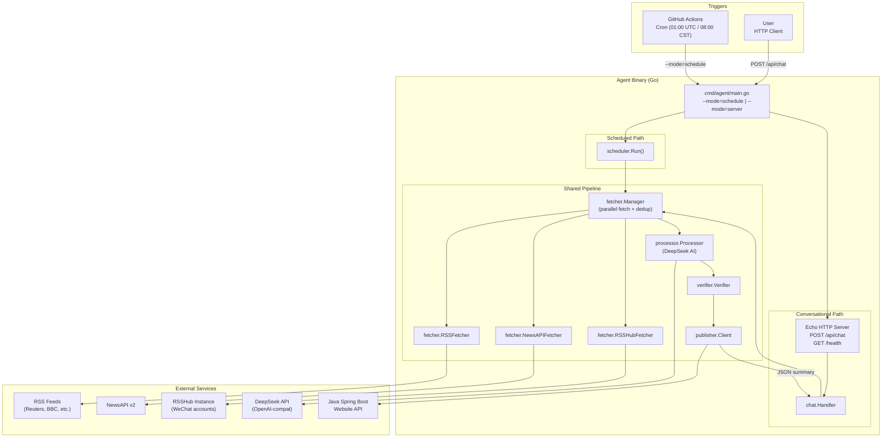
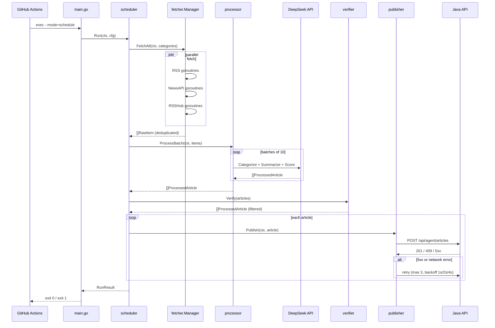
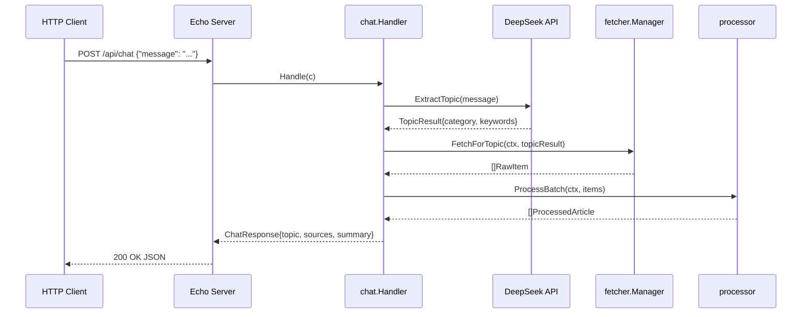

# Daily Info Agent — Technical Design Document

**Version**: 1.0  
**Date**: 2026-05-29  
**Status**: Draft  
**Module**: `github.com/user/daily-info-agent`

---

## 1. System Architecture

### 1.1 High-Level Component Diagram



### 1.2 Scheduled Mode Sequence



### 1.3 Conversational Mode Sequence



---

## 2. Project Directory Structure

```
daily-info-agent/
├── cmd/
│   └── agent/
│       └── main.go                    # Entry point; parses --mode flag; wires dependencies
│
├── internal/
│   ├── fetcher/
│   │   ├── fetcher.go                 # Fetcher interface + shared HTTP client factory
│   │   ├── rss.go                     # RSS 2.0 / Atom via gofeed
│   │   ├── newsapi.go                 # NewsAPI v2/everything client
│   │   ├── rsshub.go                  # RSSHub adapter (thin wrapper over rss.go)
│   │   └── manager.go                 # Parallel orchestration + URL deduplication cache
│   │
│   ├── processor/
│   │   ├── processor.go               # DeepSeek calls: categorize + summarize + score
│   │   └── prompts.go                 # Prompt templates as typed constants
│   │
│   ├── verifier/
│   │   └── verifier.go                # Whitelist check + AI score threshold
│   │
│   ├── publisher/
│   │   └── client.go                  # HTTP POST to Java website API with retry
│   │
│   ├── chat/
│   │   └── handler.go                 # Echo HTTP handler for POST /api/chat
│   │
│   └── scheduler/
│       └── scheduler.go               # Full pipeline orchestration for scheduled mode
│
├── pkg/
│   ├── config/
│   │   └── config.go                  # Load + validate all env vars into Config struct
│   ├── models/
│   │   └── models.go                  # All shared domain structs
│   └── backoff/
│       └── backoff.go                 # Exponential backoff helper (no external dep)
│
├── cache/
│   └── .gitkeep                       # Deduplication cache dir; dedup.json written here at runtime
│
├── .github/
│   └── workflows/
│       └── daily-fetch.yml            # GitHub Actions cron workflow
│
├── .env.example                       # All env vars with placeholder values (no real secrets)
├── go.mod                             # module github.com/user/daily-info-agent; go 1.22
├── go.sum
└── Makefile                           # build, test, lint, run-schedule, run-server targets
```

---

## 3. Domain Models

All types live in `pkg/models/models.go`.

```go
package models

import "time"

// -----------------------------------------------------------------------
// Category
// -----------------------------------------------------------------------

// Category represents one of the five news categories.
type Category string

const (
    CategoryFinance       Category = "金融"
    CategoryPolitics      Category = "政治"
    CategoryEconomy       Category = "经济"
    CategoryTechAI        Category = "科技/AI"
    CategoryInternational Category = "国际"
)

// AllCategories is the canonical ordered list used for validation and defaults.
var AllCategories = []Category{
    CategoryFinance,
    CategoryPolitics,
    CategoryEconomy,
    CategoryTechAI,
    CategoryInternational,
}

// CategoryDisplayName returns a bilingual label used in prompts and logs.
func (c Category) DisplayName() string {
    switch c {
    case CategoryFinance:
        return "金融 (Finance)"
    case CategoryPolitics:
        return "政治 (Politics)"
    case CategoryEconomy:
        return "经济 (Economy)"
    case CategoryTechAI:
        return "科技/AI (Tech/AI)"
    case CategoryInternational:
        return "国际 (International)"
    default:
        return string(c)
    }
}

// -----------------------------------------------------------------------
// RawItem — output of any Fetcher, before AI processing
// -----------------------------------------------------------------------

// SourceType identifies which adapter produced the item.
type SourceType string

const (
    SourceTypeRSS     SourceType = "rss"
    SourceTypeNewsAPI SourceType = "newsapi"
    SourceTypeRSSHub  SourceType = "rsshub"
)

// RawItem is the normalised output of any data-source adapter.
// All fields from heterogeneous sources are mapped into this common shape.
type RawItem struct {
    // Identity
    URL          string     `json:"url"`           // canonical article URL (used as dedup key)
    SourceDomain string     `json:"source_domain"` // registered domain, e.g. "reuters.com"
    SourceType   SourceType `json:"source_type"`

    // Content
    Title       string `json:"title"`
    Description string `json:"description"` // raw excerpt / feed description
    Content     string `json:"content"`     // full text if available; may be empty

    // Timing
    PublishedAt time.Time `json:"published_at"`
    FetchedAt   time.Time `json:"fetched_at"`

    // Language hint from feed metadata (BCP-47, e.g. "en", "zh")
    Language string `json:"language"`
}

// -----------------------------------------------------------------------
// FetchConfig — per-source configuration
// -----------------------------------------------------------------------

// FetchConfig holds all parameters for a single source endpoint.
type FetchConfig struct {
    Type       SourceType
    URL        string            // feed URL or NewsAPI endpoint
    Categories []Category        // categories this source is expected to cover
    Params     map[string]string // extra query params (e.g. NewsAPI "q", "language")
    Timeout    time.Duration     // defaults to 10s if zero
}

// -----------------------------------------------------------------------
// AIBatchRequest / AIBatchResponse — internal processor types
// -----------------------------------------------------------------------

// AIBatchRequest groups up to 10 RawItems for a single DeepSeek API call.
type AIBatchRequest struct {
    Items []*RawItem
    RunID string
}

// AIItemResult holds the AI output for one RawItem.
type AIItemResult struct {
    URL              string   // echoed back for correlation
    Category         Category
    Summary          string   // 100–200 Chinese characters
    CredibilityScore float64  // 0.0 – 1.0
    Tags             []string // up to 10 keywords
    Language         string   // detected BCP-47 language
}

// -----------------------------------------------------------------------
// VerificationResult
// -----------------------------------------------------------------------

// SkipReason is a machine-readable explanation for why an item was not published.
type SkipReason string

const (
    SkipReasonLowScore       SkipReason = "low_credibility_score"
    SkipReasonNotWhitelisted SkipReason = "domain_not_whitelisted_and_score_below_threshold"
)

// VerificationResult is produced by the verifier for every processed article.
type VerificationResult struct {
    Pass       bool
    SkipReason SkipReason // empty when Pass == true
    DomainHit  bool       // true if domain was in whitelist
}

// -----------------------------------------------------------------------
// ProcessedArticle — fully enriched, ready-to-publish item
// -----------------------------------------------------------------------

// ProcessedArticle is a RawItem enriched with AI outputs and verification.
type ProcessedArticle struct {
    // Embedded raw data
    Raw *RawItem

    // AI results
    Category         Category
    Summary          string
    CredibilityScore float64
    Tags             []string
    DetectedLanguage string

    // Verification
    Verification VerificationResult

    // Pipeline provenance
    RunID        string
    AgentVersion string
}

// -----------------------------------------------------------------------
// PublishRequest — wire format POSTed to the Java website API
// -----------------------------------------------------------------------

// PublishRequest is the exact JSON body sent to POST /api/agent/articles.
// Field names use snake_case to match the Java API contract (Section 6 of PRD).
type PublishRequest struct {
    SourceURL        string   `json:"source_url"`
    Title            string   `json:"title"`
    Summary          string   `json:"summary"`
    Category         string   `json:"category"`          // string, not Category type, for JSON portability
    SourceDomain     string   `json:"source_domain"`
    CredibilityScore float64  `json:"credibility_score"`
    PublishedAt      string   `json:"published_at"`      // ISO 8601 UTC, e.g. "2026-05-29T01:30:00Z"
    FetchedAt        string   `json:"fetched_at"`        // ISO 8601 UTC
    RunID            string   `json:"run_id"`
    Tags             []string `json:"tags,omitempty"`
    Language         string   `json:"language,omitempty"`
    AgentVersion     string   `json:"agent_version,omitempty"`
}

// PublishResponse is the HTTP 201 body returned by the Java API.
type PublishResponse struct {
    ID        int64  `json:"id"`
    SourceURL string `json:"source_url"`
    CreatedAt string `json:"created_at"`
    Status    string `json:"status"`
}

// PublishErrorResponse is the body of 4xx / 5xx responses.
type PublishErrorResponse struct {
    Error      string `json:"error"`
    Message    string `json:"message"`
    Field      string `json:"field,omitempty"`       // validation errors
    ExistingID int64  `json:"existing_id,omitempty"` // 409 only
}

// -----------------------------------------------------------------------
// Chat API types
// -----------------------------------------------------------------------

// ChatRequest is the JSON body of POST /api/chat.
type ChatRequest struct {
    Message string `json:"message"`
}

// ChatSource is a single source article referenced in a chat response.
type ChatSource struct {
    URL          string  `json:"url"`
    Title        string  `json:"title"`
    SourceDomain string  `json:"source_domain"`
    CredScore    float64 `json:"credibility_score"`
}

// ChatResponse is the JSON body returned by POST /api/chat.
type ChatResponse struct {
    ExtractedTopic string       `json:"extracted_topic"`
    Category       string       `json:"category"`
    Summary        string       `json:"summary"`        // AI-generated aggregate summary in Chinese
    Sources        []ChatSource `json:"sources"`
    FetchedAt      string       `json:"fetched_at"`     // ISO 8601
    LatencyMs      int64        `json:"latency_ms"`
}

// -----------------------------------------------------------------------
// RunResult — summary returned by scheduler after a scheduled run
// -----------------------------------------------------------------------

// RunResult is returned by scheduler.Run and used for exit-code decisions.
type RunResult struct {
    RunID          string
    TotalFetched   int
    TotalProcessed int
    TotalPublished int
    TotalSkipped   int
    TotalFailed    int
    DurationMs     int64
    FatalError     error // non-nil causes exit 1
}
```

---

## 4. Module Responsibilities & Interfaces

### 4.1 `pkg/config` — Configuration Loading

**Responsibility**: Load, validate, and expose all environment variables as a typed `Config` struct. Called once at startup; panics on missing required vars.

```go
package config

// Config holds all runtime configuration loaded from environment variables.
type Config struct {
    // AI
    DeepSeekAPIKey  string
    DeepSeekModelID string
    DeepSeekBaseURL string // default: "https://api.deepseek.com/v1"

    // Data sources
    NewsAPIKey    string
    RSSHubBaseURL string   // default: "https://rsshub.app"
    RSSFeeds      []string // parsed from semicolon-separated env var

    // Verification
    TrustedDomains     []string // parsed from comma-separated env var
    SkipVerification   bool
    DefaultCategories  []models.Category

    // Publishing
    WebsiteAPIBaseURL string
    WebsiteAPIToken   string

    // HTTP server
    BindAddr string // default: "127.0.0.1:8080"

    // Observability
    LogLevel    slog.Level
    AgentVersion string // injected at build time via -ldflags

    // Runtime
    CacheFilePath string // default: "cache/dedup.json"
}

// Load reads all environment variables and returns a validated Config.
// Returns an error listing all missing required variables (fail-fast, not first-error).
func Load() (*Config, error)
```

### 4.2 `internal/fetcher` — Data Source Adapters

**Responsibility**: Fetch raw news items from configured sources, enforce HTTP timeouts, return normalised `[]models.RawItem`.

```go
package fetcher

// Fetcher is the common interface for all data-source adapters.
type Fetcher interface {
    // Fetch retrieves items from the source. Returns a typed FetchError on failure;
    // never panics. An empty slice with nil error is valid (source returned no items).
    Fetch(ctx context.Context, cfg models.FetchConfig) ([]models.RawItem, error)
    // Name returns a human-readable identifier used in logs.
    Name() string
}

// NewRSSFetcher constructs a Fetcher backed by gofeed for RSS 2.0 / Atom.
func NewRSSFetcher(httpClient *http.Client) Fetcher

// NewNewsAPIFetcher constructs a Fetcher for the NewsAPI v2/everything endpoint.
func NewNewsAPIFetcher(apiKey string, httpClient *http.Client) Fetcher

// NewRSSHubFetcher constructs a Fetcher that delegates to NewRSSFetcher
// but prepends the RSSHub base URL to relative route paths.
func NewRSSHubFetcher(baseURL string, httpClient *http.Client) Fetcher

// Manager orchestrates parallel fetching across all configured sources
// and applies URL-based deduplication against the cache file.
type Manager struct { /* unexported fields */ }

// NewManager creates a Manager wired with the provided fetchers and cache path.
func NewManager(fetchers []Fetcher, cacheFile string, logger *slog.Logger) *Manager

// FetchAll fetches from all sources in parallel and returns deduplicated items.
// categories filters which FetchConfigs to activate; nil means all.
func (m *Manager) FetchAll(ctx context.Context, cfgs []models.FetchConfig) ([]models.RawItem, error)

// FetchForTopic fetches items relevant to the given keywords across all sources.
// Used by the conversational handler; returns at most maxItems results.
func (m *Manager) FetchForTopic(ctx context.Context, keywords []string, maxItems int) ([]models.RawItem, error)

// FetchError is the typed error returned by adapters on source failure.
type FetchError struct {
    Source  string
    URL     string
    Wrapped error
}
func (e *FetchError) Error() string
func (e *FetchError) Unwrap() error
```

**Dependencies**: `gofeed` (RSS/Atom), `net/http`, `pkg/models`, `log/slog`.

### 4.3 `internal/processor` — AI Processing

**Responsibility**: Send batches of `RawItem` to DeepSeek API; return `ProcessedArticle` slices with category, Chinese summary, credibility score, and tags.

```go
package processor

// Processor calls DeepSeek for AI enrichment.
type Processor struct { /* unexported */ }

// New creates a Processor using the given go-openai client pointed at DeepSeek.
func New(client *openai.Client, modelID string, logger *slog.Logger) *Processor

// ProcessBatch enriches a batch of raw items with AI outputs.
// Items are split internally into sub-batches of up to 10 before each API call.
// If DeepSeek is unavailable, affected items are returned with zero-value AI fields
// and a DeepSeekUnavailableError logged; the function does not return an error in
// that case to enable graceful degradation.
func (p *Processor) ProcessBatch(ctx context.Context, items []models.RawItem, runID string) ([]models.ProcessedArticle, error)

// ExtractTopic asks DeepSeek to identify the topic and most relevant category
// from a free-form user message (used by the chat handler).
func (p *Processor) ExtractTopic(ctx context.Context, message string) (TopicResult, error)

// TopicResult holds the structured output of topic extraction.
type TopicResult struct {
    Category models.Category
    Keywords []string // search terms to pass to FetchForTopic
    Summary  string   // one-sentence description of what the user wants
}

// DeepSeekUnavailableError is returned (and logged) when all retries to
// DeepSeek fail. Individual ProcessBatch items still return; this error
// is informational, not fatal.
type DeepSeekUnavailableError struct {
    Cause error
}
```

**Dependencies**: `github.com/sashabaranov/go-openai`, `pkg/models`, `log/slog`.

### 4.4 `internal/verifier` — Source Credibility

**Responsibility**: Apply the two-path credibility policy (whitelist OR AI score >= 0.7) and annotate each article with a `VerificationResult`.

```go
package verifier

// Verifier applies source credibility rules to processed articles.
type Verifier struct { /* unexported */ }

// New creates a Verifier with the given whitelist domains and skip flag.
func New(trustedDomains []string, skipVerification bool, logger *slog.Logger) *Verifier

// Verify filters a slice of ProcessedArticles, setting Verification on each.
// All items are returned; callers should check article.Verification.Pass to decide
// whether to publish.
func (v *Verifier) Verify(articles []models.ProcessedArticle) []models.ProcessedArticle

// IsTrustedDomain reports whether the given registered domain is in the whitelist.
// Exported for use in tests.
func (v *Verifier) IsTrustedDomain(domain string) bool
```

**Dependencies**: `pkg/models`, `log/slog`. No external network calls.

### 4.5 `internal/publisher` — Website API Client

**Responsibility**: POST `PublishRequest` to the Java website API; handle retry logic; return a typed `PublishResult`.

```go
package publisher

// Client posts articles to the Java website API.
type Client struct { /* unexported */ }

// New creates a Client for the given base URL, auth token, and HTTP client.
func New(baseURL, token string, httpClient *http.Client, logger *slog.Logger) *Client

// Publish sends a single ProcessedArticle to the website API.
// Implements 3-attempt exponential backoff (1s / 2s / 4s) for 5xx and network errors.
// Returns a PublishResult whose Outcome field signals success, duplicate, or failure.
func (c *Client) Publish(ctx context.Context, article models.ProcessedArticle, runID string) PublishResult

// PublishOutcome is a machine-readable result code.
type PublishOutcome string

const (
    OutcomePublished      PublishOutcome = "published"
    OutcomeDuplicate      PublishOutcome = "duplicate"        // HTTP 409
    OutcomePermanentFail  PublishOutcome = "permanent_fail"   // 4xx (non-409)
    OutcomeMaxRetriesHit  PublishOutcome = "max_retries_hit"  // 5xx after 3 attempts
)

// PublishResult describes the outcome of a single publish attempt.
type PublishResult struct {
    Outcome    PublishOutcome
    ArticleURL string
    Attempts   int
    StatusCode int   // final HTTP status code; 0 on network error
    RemoteID   int64 // populated on OutcomePublished (from 201 response)
    Err        error
}
```

**Dependencies**: `net/http`, `encoding/json`, `pkg/models`, `pkg/backoff`, `log/slog`.

### 4.6 `internal/scheduler` — Scheduled Pipeline Orchestration

**Responsibility**: Wire fetcher → processor → verifier → publisher into a single `Run()` call; build the `RunResult` summary; exit non-zero on fatal errors.

```go
package scheduler

// Scheduler owns the full scheduled pipeline.
type Scheduler struct { /* unexported */ }

// New wires all pipeline stages together.
func New(
    mgr     *fetcher.Manager,
    proc    *processor.Processor,
    ver     *verifier.Verifier,
    pub     *publisher.Client,
    cfg     *config.Config,
    logger  *slog.Logger,
) *Scheduler

// Run executes the full pipeline for the configured default categories.
// It is designed to be called from main() in scheduled mode.
// Returns a RunResult; RunResult.FatalError != nil signals exit 1.
func (s *Scheduler) Run(ctx context.Context) models.RunResult
```

### 4.7 `internal/chat` — Conversational HTTP Handler

**Responsibility**: Implement `POST /api/chat` — extract topic, fetch, process, and return a structured JSON response within 30 seconds.

```go
package chat

// Handler implements the Echo handler for POST /api/chat.
type Handler struct { /* unexported */ }

// New creates a Handler wired to the processor and fetcher manager.
func New(
    proc   *processor.Processor,
    mgr    *fetcher.Manager,
    cfg    *config.Config,
    logger *slog.Logger,
) *Handler

// Handle is the Echo HandlerFunc registered at POST /api/chat.
func (h *Handler) Handle(c echo.Context) error
```

---

## 5. DeepSeek API Integration

### 5.1 Client Construction

DeepSeek exposes an OpenAI-compatible REST API. The `go-openai` library is used with a custom `BaseURL`:

```go
// internal/processor/processor.go
import openai "github.com/sashabaranov/go-openai"

func NewDeepSeekClient(apiKey, baseURL string) *openai.Client {
    cfg := openai.DefaultConfig(apiKey)
    cfg.BaseURL = baseURL // e.g. "https://api.deepseek.com/v1"
    return openai.NewClientWithConfig(cfg)
}
```

The model ID is never hardcoded; it is read from `DEEPSEEK_MODEL_ID` (e.g. `deepseek-chat` or a future model ID).

### 5.2 Batch AI Call Strategy

To satisfy FR-AI-005 (max 15 calls for 50 items), `ProcessBatch` splits the input into sub-batches of at most 10 items and makes one API call per sub-batch. Each call asks DeepSeek to return structured JSON for all items in that batch simultaneously.

```
50 items → 5 sub-batches of 10 → 5 categorisation calls (one per batch)
         → 5 summarisation calls OR combined with categorisation if token budget allows
```

To further reduce API calls, categorisation, summarisation, and credibility scoring are combined into **a single prompt per batch**, requesting a JSON array back.

### 5.3 Prompt Design

#### System Prompt (shared across all batch calls)

```
You are a professional news analyst. You will receive a JSON array of news items.
For each item, return a JSON array with the same length, in the same order.
Output ONLY valid JSON — no markdown, no explanation, no code fences.
```

#### Batch Processing User Prompt Template

```
Analyse the following {{N}} news items and return a JSON array of objects.
Each object must have exactly these fields:
  "url":               string  — copy from input, used for correlation
  "category":          string  — exactly one of: 金融, 政治, 经济, 科技/AI, 国际
  "summary":           string  — concise Chinese summary, 100–200 Chinese characters
  "credibility_score": number  — float 0.0–1.0 rating the source reliability of the domain
  "tags":              array   — up to 10 keyword strings (English or Chinese)
  "language":          string  — BCP-47 language code of the original article (e.g. "en", "zh")

Credibility scoring guidance:
  1.0 = authoritative government or major wire service (xinhua.net, reuters.com, bbc.com)
  0.8 = established mainstream media (theverge.com, people.com.cn)
  0.5 = mid-tier or regional outlet, content farm, or unverifiable source
  0.0 = known misinformation source or spam

Input items:
{{JSON_ARRAY_OF_RAW_ITEMS}}
```

The `RawItem` fields sent to DeepSeek include: `url`, `source_domain`, `title`, `description`, `language`. The `content` field is truncated to 500 characters to stay within token budget.

#### Topic Extraction Prompt (conversational mode)

```
The user sent this message: "{{USER_MESSAGE}}"

Return a JSON object with:
  "category": one of 金融, 政治, 经济, 科技/AI, 国际
  "keywords": array of 3–5 English search keywords suitable for a news query
  "summary":  one sentence describing what the user wants to know

Output ONLY valid JSON.
```

### 5.4 Token Budget

| Call type | Input tokens (est.) | Output tokens (est.) | Calls per 200-item run |
|-----------|--------------------|--------------------|----------------------|
| Batch process (10 items) | ~1 500 | ~800 | 20 |
| Topic extraction | ~200 | ~100 | 1 (conversational only) |

At ~20 batch calls per scheduled run, total token usage is approximately 46 000 tokens per run, well within typical rate limits.

### 5.5 Rate Limiting

- A **100 ms minimum inter-call delay** is enforced between consecutive DeepSeek requests using `time.Sleep` within the batch loop.
- The processor respects `ctx` cancellation so the full pipeline can be aborted if the 15-minute GitHub Actions timeout approaches.
- On a non-2xx response, the processor retries **once** after a 2-second delay before declaring `DeepSeekUnavailableError`.

### 5.6 Response Parsing & Fallback

DeepSeek output is parsed with `encoding/json` into `[]AIItemResult`. If parsing fails for a batch (malformed JSON), the processor falls back to processing items individually in that batch. If individual retries also fail, those items are marked with zero-value AI fields and logged at `WARN`. Items with no AI summary are still eligible for publication if their domain is whitelisted (graceful degradation per FR-AI-006).

---

## 6. HTTP API Design (Conversational Mode)

The HTTP server uses the **Echo** framework (`github.com/labstack/echo/v4`).

### 6.1 Server Bootstrap

```go
// cmd/agent/main.go (server mode)
e := echo.New()
e.HideBanner = true
e.Use(middleware.RequestID())
e.Use(middleware.TimeoutWithConfig(middleware.TimeoutConfig{
    Timeout: 30 * time.Second, // enforces FR-CON-004
}))
e.Use(slogMiddleware(logger)) // structured request logging

e.POST("/api/chat", chatHandler.Handle)
e.GET("/health", healthHandler)

e.Logger.Fatal(e.Start(cfg.BindAddr))
```

The server binds to `127.0.0.1:8080` by default. Overriding `BIND_ADDR=0.0.0.0:8080` exposes it externally.

### 6.2 `POST /api/chat`

**Request**

```
POST /api/chat
Content-Type: application/json

{
  "message": "Tell me about AI chip news today"
}
```

| Field | Type | Required | Constraints |
|-------|------|----------|-------------|
| `message` | string | Yes | 1–500 characters |

**Success Response — HTTP 200**

```json
{
  "extracted_topic": "AI chip semiconductor news",
  "category":        "科技/AI",
  "summary":         "今日AI芯片领域...(100–200汉字AI生成摘要)...",
  "sources": [
    {
      "url":               "https://www.theverge.com/...",
      "title":             "NVIDIA announces next-gen GPU",
      "source_domain":     "theverge.com",
      "credibility_score": 0.85
    }
  ],
  "fetched_at":  "2026-05-29T09:01:12Z",
  "latency_ms":  4230
}
```

**Error Responses**

| HTTP Status | Condition | Body `error` field |
|-------------|-----------|---------------------|
| 400 | Missing or empty `message` | `"validation_error"` |
| 400 | Message exceeds 500 chars | `"message_too_long"` |
| 504 | Pipeline exceeded 30s timeout | `"timeout"` |
| 500 | Unexpected internal error | `"internal_error"` |

**Behaviour**:
1. Validate request body; return 400 on violation.
2. Call `processor.ExtractTopic` to get category and keywords.
3. Call `manager.FetchForTopic(ctx, keywords, maxItems=20)`.
4. Call `processor.ProcessBatch` on fetched items.
5. Apply verifier; filter to passing items.
6. Build `ChatResponse` with up to 5 top-scoring sources and an aggregate Chinese summary.
7. Return 200; the `latency_ms` field reflects wall-clock time from request receipt.

**Conversational mode does NOT publish to the Java website API**. It returns results directly to the HTTP caller only.

### 6.3 `GET /health`

**Request**

```
GET /health
```

**Response — HTTP 200**

```json
{
  "status":  "ok",
  "version": "1.0.0",
  "time":    "2026-05-29T09:00:00Z"
}
```

This endpoint performs no I/O (no DeepSeek or website API pings). It is suitable for Docker / load-balancer health probes.

---

## 7. Website API Contract

The Go `PublishRequest` struct (defined in Section 3) maps directly to the JSON contract specified in PRD Section 6. The publisher constructs it as follows:

```go
func articleToPublishRequest(a models.ProcessedArticle) models.PublishRequest {
    return models.PublishRequest{
        SourceURL:        a.Raw.URL,
        Title:            a.Raw.Title,
        Summary:          a.Summary,
        Category:         string(a.Category),
        SourceDomain:     a.Raw.SourceDomain,
        CredibilityScore: a.CredibilityScore,
        PublishedAt:      a.Raw.PublishedAt.UTC().Format(time.RFC3339),
        FetchedAt:        a.Raw.FetchedAt.UTC().Format(time.RFC3339),
        RunID:            a.RunID,
        Tags:             a.Tags,
        Language:         a.DetectedLanguage,
        AgentVersion:     a.AgentVersion,
    }
}
```

**Authentication header** (set on every request):

```
Authorization: Bearer <cfg.WebsiteAPIToken>
Content-Type: application/json
```

**Retry policy** (implemented in `publisher.Client.Publish`):

| HTTP Status | Action |
|-------------|--------|
| 2xx | Record `OutcomePublished`; done |
| 409 | Record `OutcomeDuplicate`; log `already_published=true`; done (no retry) |
| 4xx (not 409) | Record `OutcomePermanentFail`; log `skip_reason=client_error`; done (no retry) |
| 5xx or network error | Retry with backoff: attempt 1 after 1s, attempt 2 after 2s, attempt 3 after 4s |
| 5xx after 3 retries | Record `OutcomeMaxRetriesHit`; log error |

**Rate limiting courtesy delay**: 100 ms `time.Sleep` between consecutive `Publish` calls to stay within the Java API's 60 req/min limit.

---

## 8. GitHub Actions Workflow

### `.github/workflows/daily-fetch.yml`

```yaml
name: Daily News Fetch

on:
  schedule:
    # 01:00 UTC = 08:00 CST (UTC+8) — satisfies FR-SCH-001
    - cron: '0 1 * * *'
  workflow_dispatch: {} # allows manual trigger for testing

permissions:
  contents: read

jobs:
  fetch-and-publish:
    runs-on: ubuntu-latest
    timeout-minutes: 20   # hard cap; agent self-limits to 15 min

    steps:
      - name: Checkout
        uses: actions/checkout@v4

      - name: Set up Go
        uses: actions/setup-go@v5
        with:
          go-version: '1.22'
          cache: true

      - name: Restore deduplication cache
        uses: actions/cache@v4
        with:
          path: cache/dedup.json
          # Key includes a 7-day window so old entries expire naturally
          key: dedup-cache-${{ github.run_id }}
          restore-keys: |
            dedup-cache-

      - name: Build
        run: go build -ldflags="-X main.version=1.0.0" -o agent ./cmd/agent

      - name: Run scheduled fetch
        run: ./agent --mode=schedule
        env:
          DEEPSEEK_API_KEY:      ${{ secrets.DEEPSEEK_API_KEY }}
          DEEPSEEK_MODEL_ID:     ${{ secrets.DEEPSEEK_MODEL_ID }}
          NEWSAPI_KEY:           ${{ secrets.NEWSAPI_KEY }}
          RSSHUB_BASE_URL:       ${{ vars.RSSHUB_BASE_URL }}
          RSS_FEEDS:             ${{ vars.RSS_FEEDS }}
          TRUSTED_DOMAINS:       ${{ vars.TRUSTED_DOMAINS }}
          DEFAULT_CATEGORIES:    ${{ vars.DEFAULT_CATEGORIES }}
          WEBSITE_API_BASE_URL:  ${{ secrets.WEBSITE_API_BASE_URL }}
          WEBSITE_API_TOKEN:     ${{ secrets.WEBSITE_API_TOKEN }}
          LOG_LEVEL:             INFO

      - name: Save deduplication cache
        if: always() # save even if the run step fails, to preserve dedup state
        uses: actions/cache@v4
        with:
          path: cache/dedup.json
          key: dedup-cache-${{ github.run_id }}
```

### Required GitHub Secrets

| Secret Name | Description |
|-------------|-------------|
| `DEEPSEEK_API_KEY` | DeepSeek authentication key |
| `DEEPSEEK_MODEL_ID` | DeepSeek model identifier |
| `NEWSAPI_KEY` | NewsAPI v2 key |
| `WEBSITE_API_BASE_URL` | Base URL of the Java website (no trailing slash) |
| `WEBSITE_API_TOKEN` | Bearer token for the website API |

### Required GitHub Variables (non-secret)

| Variable Name | Description |
|---------------|-------------|
| `RSSHUB_BASE_URL` | RSSHub instance URL |
| `RSS_FEEDS` | Semicolon-separated RSS feed URLs |
| `TRUSTED_DOMAINS` | Comma-separated trusted domain whitelist |
| `DEFAULT_CATEGORIES` | Comma-separated category list |

---

## 9. Configuration Reference

All configuration is loaded by `pkg/config.Load()` from OS environment variables. The binary never reads `.env` files directly in production; the `.env.example` file documents available variables for local development (loaded via `source .env` or a tool like `direnv`).

| Variable | Required | Default | Description | Example |
|----------|----------|---------|-------------|---------|
| `DEEPSEEK_API_KEY` | Yes | — | DeepSeek API authentication key | `sk-...` |
| `DEEPSEEK_MODEL_ID` | Yes | — | DeepSeek model identifier | `deepseek-chat` |
| `DEEPSEEK_BASE_URL` | No | `https://api.deepseek.com/v1` | Override for proxy or future API versions | `https://api.deepseek.com/v1` |
| `NEWSAPI_KEY` | Yes | — | NewsAPI v2 key | `abc123...` |
| `RSSHUB_BASE_URL` | No | `https://rsshub.app` | Self-hosted RSSHub base URL | `https://rsshub.example.com` |
| `RSS_FEEDS` | No | built-in list | Semicolon-separated RSS feed URLs | `https://feeds.reuters.com/reuters/...;https://...` |
| `TRUSTED_DOMAINS` | No | built-in list | Comma-separated domain whitelist | `xinhua.net,people.com.cn,reuters.com,bbc.com` |
| `DEFAULT_CATEGORIES` | No | `金融,政治,经济,科技/AI,国际` | Categories processed in scheduled mode | `科技/AI,金融` |
| `WEBSITE_API_BASE_URL` | Yes | — | Java website base URL (no trailing slash) | `https://mysite.example.com` |
| `WEBSITE_API_TOKEN` | Yes | — | Bearer token for website API | `eyJ...` |
| `SKIP_VERIFICATION` | No | `false` | Bypass credibility checks (debug only) | `true` |
| `BIND_ADDR` | No | `127.0.0.1:8080` | HTTP server listen address | `0.0.0.0:8080` |
| `LOG_LEVEL` | No | `INFO` | Minimum log level | `DEBUG` |
| `CACHE_FILE_PATH` | No | `cache/dedup.json` | Path to URL deduplication cache file | `/tmp/dedup.json` |

**Built-in RSS feed defaults** (compiled into the binary, overridable at runtime):

```
https://feeds.reuters.com/reuters/topNews
https://feeds.bbci.co.uk/news/world/rss.xml
https://www.theverge.com/rss/index.xml
http://www.xinhuanet.com/rss/world.xml
http://www.people.com.cn/rss/finance.xml
```

**Built-in trusted domain defaults**:

```
xinhua.net, people.com.cn, gov.cn, reuters.com, bbc.com,
theverge.com, apnews.com, ft.com, wsj.com, economist.com
```

---

## 10. Error Handling & Retry Strategy

### 10.1 Per-Module Error Types

Each module defines its own sentinel errors. All implement the standard `error` interface and are designed for use with `errors.Is` / `errors.As`.

```go
// fetcher package
type FetchError struct {
    Source  string
    URL     string
    Wrapped error
}

// processor package
type DeepSeekUnavailableError struct{ Cause error }
type DeepSeekParseError struct{ Raw string; Cause error }

// publisher package
type PublishHTTPError struct {
    StatusCode int
    Body       string
    URL        string
    Attempt    int
}

// config package
type MissingConfigError struct{ Vars []string }
```

### 10.2 Retry Policy

The `pkg/backoff` package provides a reusable `Retry` function used by the publisher:

```go
package backoff

// Retry calls fn up to maxAttempts times. It waits baseDelay * 2^(attempt-1)
// between retries (exponential backoff). It only retries when fn returns a
// RetryableError. On success or a non-retryable error, it returns immediately.
func Retry(ctx context.Context, maxAttempts int, baseDelay time.Duration, fn func() error) error

// RetryableError wraps an error to signal that the operation should be retried.
type RetryableError struct{ Cause error }
```

Publisher retry schedule:

| Attempt | Delay before this attempt |
|---------|--------------------------|
| 1 | 0 s (immediate) |
| 2 | 1 s |
| 3 | 2 s |
| 4 | 4 s (then give up) |

### 10.3 DeepSeek Unavailability (Graceful Degradation)

When DeepSeek returns non-2xx responses on all retry attempts:

1. `processor.ProcessBatch` logs `WARN` with `deepseek_unavailable=true` and the error.
2. Each affected `RawItem` is promoted to a `ProcessedArticle` with:
   - `Category`: empty string (will fail category validation at the Java side).
   - `Summary`: empty string.
   - `CredibilityScore`: `0.0`.
3. The verifier runs as normal. Items with empty summary but whitelisted domain **pass** verification (the publisher will send them; the Java side may accept or reject based on its own validation).
4. Items from non-whitelisted domains score `0.0` and are filtered out by the verifier.
5. The scheduled run continues without AI processing for the remainder of the batch.
6. `RunResult.FatalError` is **not** set; the run exits 0 with a `WARN`-level summary noting AI degradation.

### 10.4 Source Unavailability

If an individual RSS feed, NewsAPI, or RSSHub endpoint fails:

- The `FetchError` is logged at `WARN` with `source`, `url`, and `error` fields.
- The pipeline continues with items from all other available sources.
- If **all** sources fail, a `FatalError` is set in `RunResult` and the process exits 1.

### 10.5 Structured Logging Approach

All packages receive a `*slog.Logger` via constructor injection. No package uses a global logger. Log format is JSON for production (GitHub Actions) and text for local development.

```go
// main.go — logger construction
var handler slog.Handler
if isCI() {
    handler = slog.NewJSONHandler(os.Stdout, &slog.HandlerOptions{Level: cfg.LogLevel})
} else {
    handler = slog.NewTextHandler(os.Stdout, &slog.HandlerOptions{Level: cfg.LogLevel})
}
logger := slog.New(handler)
```

**Standard log fields** (present on every log line):

| Field | Description |
|-------|-------------|
| `time` | RFC 3339 UTC timestamp |
| `level` | `DEBUG`, `INFO`, `WARN`, `ERROR` |
| `msg` | Human-readable message |
| `run_id` | UUID for the current pipeline run (propagated via context) |
| `component` | Package name: `fetcher`, `processor`, `verifier`, `publisher`, `chat` |

**Stage timing** (logged at `INFO` on completion of each phase):

```json
{"time":"...","level":"INFO","msg":"stage_complete","run_id":"...","stage":"fetch","duration_ms":3210,"items_fetched":312}
{"time":"...","level":"INFO","msg":"stage_complete","run_id":"...","stage":"process","duration_ms":8540,"items_processed":280}
{"time":"...","level":"INFO","msg":"stage_complete","run_id":"...","stage":"verify","duration_ms":12,"items_passed":241,"items_skipped":39}
{"time":"...","level":"INFO","msg":"stage_complete","run_id":"...","stage":"publish","duration_ms":4320,"items_published":241,"items_failed":0}
```

**Secret sanitisation**: The `config.Load()` function masks any log value whose key matches `*_key`, `*_token`, or `*_secret` by replacing the value with `[REDACTED]` before it can reach any log handler. This is enforced at the config layer, not per log call.

---

## Appendix A: Key Dependencies

| Package | Version (min) | Purpose |
|---------|---------------|---------|
| `github.com/labstack/echo/v4` | v4.12 | HTTP server for conversational mode |
| `github.com/mmcdole/gofeed` | v1.3 | RSS 2.0 / Atom feed parsing |
| `github.com/sashabaranov/go-openai` | v1.24 | DeepSeek API client (OpenAI-compatible) |
| `github.com/google/uuid` | v1.6 | Run ID generation |
| `log/slog` | stdlib (Go 1.21+) | Structured logging |

All other required functionality (HTTP client, JSON, context, time) uses Go standard library only.

---

## Appendix B: Local Development Quick-Start

```bash
# 1. Copy and fill in env vars
cp .env.example .env
# edit .env with real keys

# 2. Source env vars
source .env

# 3. Run scheduled pipeline (dry-run against real APIs)
go run ./cmd/agent --mode=schedule

# 4. Run conversational HTTP server
go run ./cmd/agent --mode=server

# 5. Test conversational endpoint
curl -X POST http://127.0.0.1:8080/api/chat \
  -H 'Content-Type: application/json' \
  -d '{"message": "今天AI芯片有什么新闻？"}'

# 6. Run tests
go test ./...
```

---

*End of DESIGN.md v1.0*
