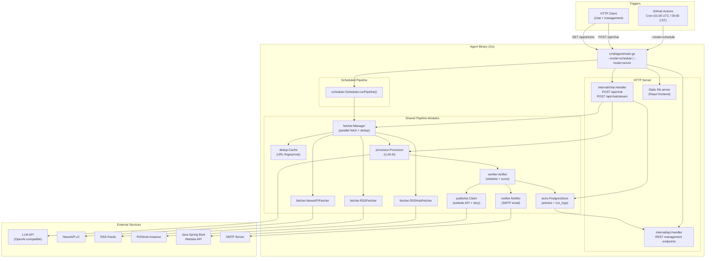
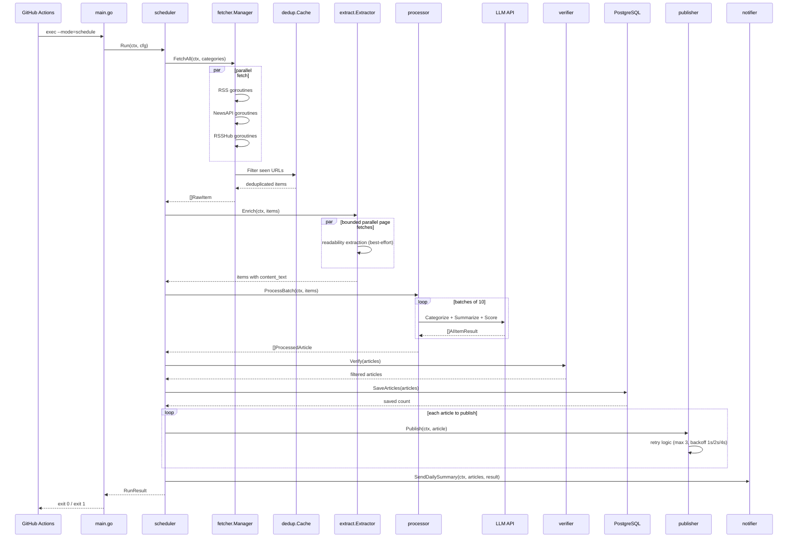
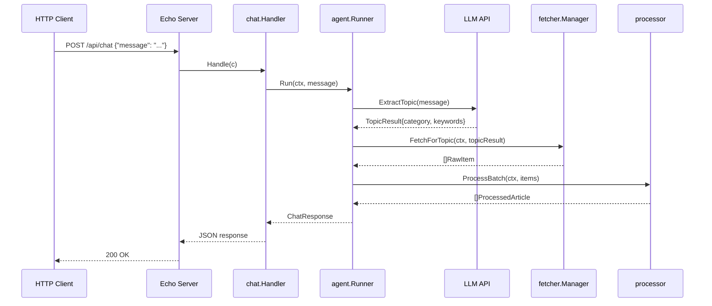
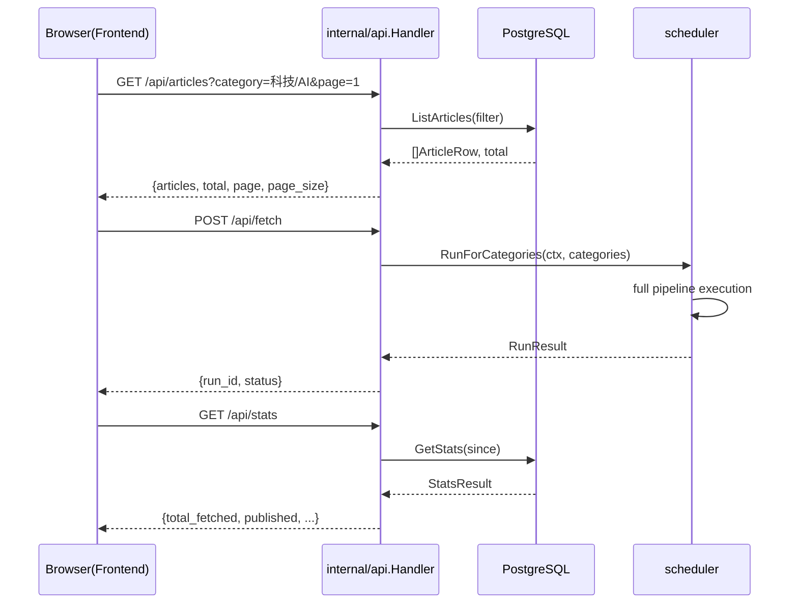

# Daily Info Agent — Technical Design Document

**Version**: 2.0  
**Date**: 2026-07-03  
**Status**: Living  
**Module**: `github.com/user/daily-info-agent`

---

## 1. System Architecture

### 1.1 High-Level Component Diagram


```mermaid
flowchart TD
    subgraph triggers["Triggers"]
        GHA["GitHub Actions\nCron (01:00 UTC / 09:00 CST)"]
        USER["HTTP Client\n(chat + management)"]
    end

    subgraph agent["Agent Binary (Go)"]
        MAIN["cmd/agent/main.go\n--mode=schedule | --mode=server"]

        subgraph sched["Scheduled Pipeline"]
            SCH["scheduler.Scheduler.runPipeline()"]
        end

        subgraph server["HTTP Server"]
            API["internal/api.Handler\nREST management endpoints"]
            CHAT["internal/chat.Handler\nPOST /api/chat\nPOST /api/chat/stream"]
            STATIC["Static file server\n(React frontend)"]
        end

        subgraph pipeline["Shared Pipeline Modules"]
            MGR["fetcher.Manager\n(parallel fetch + dedup)"]
            RSS_A["fetcher.RSSFetcher"]
            NEWS_A["fetcher.NewsAPIFetcher"]
            RSSHUB_A["fetcher.RSSHubFetcher"]
            DEDUP["dedup.Cache\n(URL fingerprints)"]
            PROC["processor.Processor\n(LLM AI)"]
            VER["verifier.Verifier\n(whitelist + score)"]
            PUB["publisher.Client\n(website API + retry)"]
            STORE["store.PostgresStore\n(articles + run_logs)"]
            NOTIF["notifier.Notifier\n(SMTP email)"]
        end
    end

    subgraph external["External Services"]
        LLM_API["LLM API\n(OpenAI-compatible)"]
        NEWSAPI["NewsAPI v2"]
        RSS_SRC["RSS Feeds"]
        RSSHUB["RSSHub Instance"]
        JAVAAPI["Java Spring Boot\nWebsite API"]
        SMTP["SMTP Server"]
    end

    GHA -->|"--mode=schedule"| MAIN
    USER -->|"POST /api/chat"| MAIN
    USER -->|"GET /api/articles"| MAIN
    MAIN --> SCH
    MAIN --> API
    MAIN --> CHAT
    MAIN --> STATIC
    SCH --> MGR
    CHAT --> MGR
    MGR --> DEDUP
    MGR --> RSS_A & NEWS_A & RSSHUB_A
    RSS_A --> RSS_SRC
    NEWS_A --> NEWSAPI
    RSSHUB_A --> RSSHUB
    MGR --> PROC
    PROC --> LLM_API
    PROC --> VER
    VER --> STORE
    VER --> PUB
    VER --> NOTIF
    PUB --> JAVAAPI
    NOTIF --> SMTP
    STORE --> API
    CHAT --> PROC
    CHAT --> STORE
```

### 1.2 Module Dependency Graph

```
cmd/agent/main.go
├── pkg/config.Load()           — env var loading
├── internal/fetcher.Manager     — parallel fetch orchestration
│   ├── internal/fetcher.RSSFetcher
│   ├── internal/fetcher.NewsAPIFetcher
│   ├── internal/fetcher.RSSHubFetcher
│   └── internal/dedup.Cache
├── internal/extract.Extractor   — original-page full-text extraction (go-readability)
├── internal/processor.Processor — AI enrichment
├── internal/verifier.Verifier   — source credibility
├── internal/publisher.Client    — website API publishing
├── internal/store.PostgresStore — PostgreSQL persistence
├── internal/notifier.Notifier   — SMTP email digest
├── internal/chat.Handler        — conversational API
├── internal/api.Handler         — management REST API
└── internal/agent.Runner        — LLM agent orchestration
    ├── internal/agent/session.go — conversation state
    ├── internal/agent/stream.go  — SSE streaming
    └── internal/agent/tools.go   — tool calling
```

### 1.3 Scheduled Mode Sequence


```mermaid
sequenceDiagram
    participant GHA as GitHub Actions
    participant Main as main.go
    participant Sched as scheduler
    participant Mgr as fetcher.Manager
    participant Dedup as dedup.Cache
    participant Ext as extract.Extractor
    participant Proc as processor
    participant LLM as LLM API
    participant Ver as verifier
    participant DB as PostgreSQL
    participant Pub as publisher
    participant Notif as notifier

    GHA->>Main: exec --mode=schedule
    Main->>Sched: Run(ctx, cfg)
    Sched->>Mgr: FetchAll(ctx, categories)
    par parallel fetch
        Mgr->>Mgr: RSS goroutines
        Mgr->>Mgr: NewsAPI goroutines
        Mgr->>Mgr: RSSHub goroutines
    end
    Mgr->>Dedup: Filter seen URLs
    Dedup-->>Mgr: deduplicated items
    Mgr-->>Sched: []RawItem
    Sched->>Ext: Enrich(ctx, items)
    par bounded parallel page fetches
        Ext->>Ext: readability extraction (best-effort)
    end
    Ext-->>Sched: items with content_text
    Sched->>Proc: ProcessBatch(ctx, items)
    loop batches of 10
        Proc->>LLM: Categorize + Summarize + Score
        LLM-->>Proc: []AIItemResult
    end
    Proc-->>Sched: []ProcessedArticle
    Sched->>Ver: Verify(articles)
    Ver-->>Sched: filtered articles
    Sched->>DB: SaveArticles(articles)
    DB-->>Sched: saved count
    loop each article to publish
        Sched->>Pub: Publish(ctx, article)
        Pub->>Pub: retry logic (max 3, backoff 1s/2s/4s)
    end
    Sched->>Notif: SendDailySummary(ctx, articles, result)
    Sched-->>Main: RunResult
    Main-->>GHA: exit 0 / exit 1
```

### 1.4 Conversational Mode Sequence


```mermaid
sequenceDiagram
    participant Client as HTTP Client
    participant Echo as Echo Server
    participant Chat as chat.Handler
    participant Agent as agent.Runner
    participant LLM as LLM API
    participant Mgr as fetcher.Manager
    participant Proc as processor

    Client->>Echo: POST /api/chat {"message": "..."}
    Echo->>Chat: Handle(c)
    Chat->>Agent: Run(ctx, message)
    Agent->>LLM: ExtractTopic(message)
    LLM-->>Agent: TopicResult{category, keywords}
    Agent->>Mgr: FetchForTopic(ctx, topicResult)
    Mgr-->>Agent: []RawItem
    Agent->>Proc: ProcessBatch(ctx, items)
    Proc-->>Agent: []ProcessedArticle
    Agent-->>Chat: ChatResponse
    Chat-->>Echo: JSON response
    Echo-->>Client: 200 OK
```

### 1.5 Management API Sequence


```mermaid
sequenceDiagram
    participant UI as Browser(Frontend)
    participant API as internal/api.Handler
    participant DB as PostgreSQL
    participant Sched as scheduler

    UI->>API: GET /api/articles?category=科技/AI&page=1
    API->>DB: ListArticles(filter)
    DB-->>API: []ArticleRow, total
    API-->>UI: {articles, total, page, page_size}

    UI->>API: POST /api/fetch
    API->>Sched: RunForCategories(ctx, categories)
    Sched->>Sched: full pipeline execution
    Sched-->>API: RunResult
    API-->>UI: {run_id, status}

    UI->>API: GET /api/stats
    API->>DB: GetStats(since)
    DB-->>API: StatsResult
    API-->>UI: {total_fetched, published, ...}
```

---

## 2. Project Directory Structure

```
daily-info-agent/
├── cmd/
│   └── agent/
│       └── main.go                    # Entry point; parses --mode flag; wires all dependencies
│
├── internal/
│   ├── agent/
│   │   ├── agent.go                   # Runner: core LLM conversation orchestration
│   │   ├── agent_test.go
│   │   ├── prompt.go                  # System prompt templates
│   │   ├── session.go                 # Session management (in-memory)
│   │   ├── session_test.go
│   │   ├── stream.go                  # SSE streaming response
│   │   ├── stream_test.go
│   │   └── tools.go                   # Tool definitions for LLM function calling
│   │
│   ├── api/
│   │   └── handler.go                 # Echo HTTP handlers for management REST API
│   │
│   ├── chat/
│   │   ├── handler.go                 # Echo handler for POST /api/chat
│   │   ├── handler_test.go
│   │   ├── ratelimit.go               # Per-IP rate limiter (token bucket)
│   │   ├── ratelimit_test.go
│   │   └── stream_handler.go          # SSE handler for POST /api/chat/stream
│   │
│   ├── dedup/
│   │   ├── dedup.go                   # URL fingerprint deduplication cache
│   │   └── dedup_test.go
│   │
│   ├── fetcher/
│   │   ├── fetcher.go                 # Fetcher interface + HTTP client factory
│   │   ├── fetcher_test.go
│   │   ├── manager.go                 # Parallel orchestration + dedup integration
│   │   ├── manager_test.go
│   │   ├── newsapi.go                 # NewsAPI v2/everything client
│   │   ├── rss.go                     # RSS 2.0 / Atom via gofeed
│   │   ├── rss_test.go
│   │   ├── rsshub.go                  # RSSHub adapter
│   │   └── rsshub_test.go
│   │
│   ├── notifier/
│   │   ├── notifier.go                # SMTP email digest sender
│   │   └── notifier_test.go
│   │
│   ├── processor/
│   │   ├── processor.go               # LLM client: batch categorize + summarize + score
│   │   ├── processor_test.go
│   │   └── prompts.go                 # Prompt templates
│   │
│   ├── publisher/
│   │   ├── client.go                  # HTTP POST to website API with retry
│   │   └── client_test.go
│   │
│   ├── scheduler/
│   │   └── scheduler.go               # Full pipeline orchestration for scheduled mode
│   │
│   ├── store/
│   │   ├── store.go                   # ArticleStore interface + PostgresStore implementation
│   │   └── queries.go                 # Named SQL constants
│   │
│   └── verifier/
│       ├── verifier.go                # Domain whitelist + AI score threshold policy
│       └── verifier_test.go
│
├── pkg/
│   ├── backoff/
│   │   └── backoff.go                 # Exponential backoff retry helper
│   ├── config/
│   │   ├── config.go                  # Load + validate all env vars into Config struct
│   │   └── config_test.go
│   └── models/
│       └── models.go                  # All shared domain structs and types
│
├── migrations/
│   ├── 001_create_articles.up.sql
│   ├── 001_create_articles.down.sql
│   ├── 002_create_run_logs.up.sql
│   ├── 002_create_run_logs.down.sql
│   ├── 003_add_articles_fts.up.sql
│   └── 003_add_articles_fts.down.sql
│
├── cache/
│   └── .gitkeep                       # Dedup cache directory
│
├── web/                               # React + TypeScript frontend
│   ├── src/
│   │   ├── App.tsx                    # Main layout with sidebar navigation
│   │   ├── api/client.ts             # HTTP API client
│   │   ├── components/               # React components
│   │   └── types/index.ts            # TypeScript types
│   └── package.json
│
├── test/
│   └── integration/
│       └── pipeline_test.go           # Build-tagged integration tests
│
├── .github/
│   └── workflows/
│       ├── ci.yml                     # PR/push CI: go vet + tests + frontend build
│       └── daily-fetch.yml            # Cron-triggered scheduled pipeline
│
├── .env.example                       # All env vars with placeholder values
├── go.mod
├── go.sum
└── Makefile
```

---

## 3. Domain Models

All types live in `pkg/models/models.go`.

### Category

```go
type Category string

const (
    CategoryFinance       Category = "金融"
    CategoryPolitics      Category = "政治"
    CategoryEconomy       Category = "经济"
    CategoryTechAI        Category = "科技/AI"
    CategoryInternational Category = "国际"
)

var AllCategories = []Category{...}
```

### RawItem — output of any Fetcher, before AI processing

```go
type RawItem struct {
    URL          string     // dedup key
    SourceDomain string     // e.g. "reuters.com"
    SourceType   SourceType // "rss", "newsapi", "rsshub"
    Title        string
    Description  string
    Content      string     // truncated to 500 chars for AI
    PublishedAt  time.Time
    FetchedAt    time.Time
    Language     string     // BCP-47, e.g. "en", "zh"
}
```

### AIItemResult — output of LLM processing for one item

```go
type AIItemResult struct {
    URL              string
    Category         Category
    Summary          string   // 100–200 Chinese chars
    CredibilityScore float64  // 0.0–1.0
    Tags             []string // up to 10
    Language         string   // BCP-47
}
```

### ProcessedArticle — fully enriched, ready-to-publish item

```go
type ProcessedArticle struct {
    Raw              *RawItem
    Category         Category
    Summary          string
    CredibilityScore float64
    Tags             []string
    DetectedLanguage string
    Verification     VerificationResult
    RunID            string
    AgentVersion     string
}
```

### ArticleRow — database row representation

```go
type ArticleRow struct {
    ID               int64
    Title            string
    Summary          string
    SourceURL        string
    SourceDomain     string
    Category         Category
    CredibilityScore float64
    Status           string   // "pending", "published", "skipped", "failed"
    Tags             []string
    Language         string
    RunID            string
    FetchedAt        time.Time
    PublishedAt      *time.Time
    CreatedAt        time.Time
    UpdatedAt        time.Time
}
```

### RunResult — pipeline execution summary

```go
type RunResult struct {
    RunID          string
    TotalFetched   int
    TotalProcessed int
    TotalSaved     int      // DB persistence
    TotalPublished int
    TotalSkipped   int
    TotalFailed    int
    DurationMs     int64
    FatalError     error    // non-nil causes exit 1
}
```

### Chat API types

```go
type ChatRequest struct {
    Message string `json:"message"`
}

type ChatResponse struct {
    ExtractedTopic string       `json:"extracted_topic"`
    Category       string       `json:"category"`
    Summary        string       `json:"summary"`
    Sources        []ChatSource `json:"sources"`
    FetchedAt      string       `json:"fetched_at"`
    LatencyMs      int64        `json:"latency_ms"`
}
```

### ProgressEvent — SSE progress reporting

```go
type ProgressEvent struct {
    Type    string `json:"type"`    // "fetch_start", "fetch_done", "ai_start", ...
    Message string `json:"message"`
    Current int    `json:"current"`
    Total   int    `json:"total"`
}
```

---

## 4. Module Responsibilities & Interfaces

### 4.1 `pkg/config` — Configuration Loading

**Responsibility**: Load, validate, and expose all environment variables as a typed `Config` struct. Called once at startup; exits on missing required vars.

```go
package config

type Config struct {
    LLMAPIKey       string
    LLMModelID      string
    LLMBaseURL      string           // default: "https://api.deepseek.com/v1"
    NewsAPIKey      string           // optional; blank disables NewsAPI
    RSSHubBaseURL   string           // default: "https://rsshub.app"
    RSSFeeds        []string
    RSSHubRoutes    []string
    SearchEngineURL string           // optional; DuckDuckGo HTML search
    TrustedDomains  []string
    SkipVerification bool
    DefaultCategories []Category
    WebsiteAPIBaseURL  string        // optional; blank disables publishing
    WebsiteAPIToken    string
    DisableJavaPublisher bool
    DatabaseDSN     string           // optional; blank disables persistence
    SMTPHost/SMTPPort/SMTPUser/...
    NotifyEmail     string
    BindAddr        string           // default: "127.0.0.1:8080"
    CORSOrigins     string           // default: "*"
    ChatAPIToken    string
    ChatRateLimitPerMin int
    LogLevel        slog.Level
    AgentVersion    string
    CacheFilePath   string           // default: "cache/dedup.json"
}

func Load() (*Config, error)
```

Key design decisions:
- Supports `.env` file loading via `godotenv.Load()` (ignores error if file doesn't exist)
- Collects all missing required vars before returning, not first-error
- Masks secret values before they reach any log handler

### 4.2 `internal/fetcher` — Data Source Adapters

**Responsibility**: Fetch raw news items from configured sources, enforce HTTP timeouts, return normalised `[]models.RawItem`.

```go
package fetcher

type Fetcher interface {
    Fetch(ctx context.Context, cfg models.FetchConfig) ([]models.RawItem, error)
    Name() string
}

func NewRSSFetcher(httpClient *http.Client) Fetcher
func NewNewsAPIFetcher(apiKey string, httpClient *http.Client) Fetcher
func NewRSSHubFetcher(baseURL string, httpClient *http.Client) Fetcher

type Manager struct { /* unexported */ }

func NewManager(fetchers []Fetcher, rssFeeds, rsshubRoutes []string,
    cacheFile string, logger *slog.Logger) *Manager

func (m *Manager) FetchAll(ctx context.Context, cfgs []models.FetchConfig) ([]models.RawItem, error)
func (m *Manager) FetchForTopic(ctx context.Context, keywords []string, maxItems int) ([]models.RawItem, error)
```

Key design decisions:
- All fetchers share the same HTTP client (configured via `fetcher.WithUserAgent`)
- Manager orchestrates parallel fetch with goroutines + error handling per source
- Built-in default RSS feeds and RSSHub routes for Chinese news sources
- `FetchForTopic` searches across sources for specific keywords (used by chat handler)

### 4.3 `internal/dedup` — URL Deduplication

**Responsibility**: Maintain a rolling file cache of seen article URLs to prevent re-publishing duplicates within a window.

```go
package dedup

type Cache struct { /* unexported */ }

func NewCache(filePath string) (*Cache, error)
func (c *Cache) Filter(ctx context.Context, items []*models.RawItem) ([]*models.RawItem, error)
func (c *Cache) Save(ctx context.Context) error
```

Key design decisions:
- JSON file-based: simple, no external dependency
- Rolling 7-day window: entries expire by age
- Thread-safe: mutex-protected for parallel fetch access

### 4.4 `internal/processor` — AI Processing

**Responsibility**: Send batches of `RawItem` to an OpenAI-compatible LLM API; return `ProcessedArticle` slices with category, Chinese summary, credibility score, and tags.

```go
package processor

type Processor struct { /* unexported */ }

func New(client *openai.Client, modelID string, logger *slog.Logger) *Processor

func (p *Processor) ProcessBatch(ctx context.Context, items []models.RawItem, runID string) ([]models.ProcessedArticle, error)
func (p *Processor) ExtractTopic(ctx context.Context, message string) (TopicResult, error)

type TopicResult struct {
    Category models.Category
    Keywords []string
    Summary  string
}
```

Key design decisions:
- Uses `github.com/sashabaranov/go-openai` (OpenAI-compatible client)
- Batches up to 10 items per LLM call to reduce API costs
- Combines categorization, summarization, and scoring in a single prompt per batch
- 100ms inter-call delay to respect rate limits
- Graceful degradation: if LLM is unavailable, returns articles with empty zero-value AI fields
- Truncates item content to 500 characters to stay within token budget

### 4.5 `internal/verifier` — Source Credibility

**Responsibility**: Apply the two-path credibility policy (whitelist OR AI score >= 0.7) and annotate each article.

```go
package verifier

type Verifier struct { /* unexported */ }

func New(trustedDomains []string, skipVerification bool, logger *slog.Logger) *Verifier

func (v *Verifier) Verify(articles []models.ProcessedArticle) []models.ProcessedArticle
func (v *Verifier) IsTrustedDomain(domain string) bool
```

Policy:
| Condition | Result |
|-----------|--------|
| Domain in whitelist | ✅ Pass (regardless of AI score) |
| Domain not in whitelist, AI score >= 0.7 | ✅ Pass |
| Domain not in whitelist, AI score < 0.7 | ❌ Skip (reason: `domain_not_whitelisted_and_score_below_threshold`) |
| `SKIP_VERIFICATION=true` | ✅ All pass |

### 4.6 `internal/publisher` — Website API Client

**Responsibility**: POST `PublishRequest` to the Java website API; handle retry logic.

```go
package publisher

type Client struct { /* unexported */ }

func New(baseURL, token string, httpClient *http.Client, logger *slog.Logger) *Client

func (c *Client) Publish(ctx context.Context, article models.ProcessedArticle) PublishResult

type PublishOutcome string
const (
    OutcomePublished      PublishOutcome = "published"
    OutcomeDuplicate      PublishOutcome = "duplicate"
    OutcomePermanentFail  PublishOutcome = "permanent_fail"
    OutcomeMaxRetriesHit  PublishOutcome = "max_retries_hit"
)
```

Retry policy:
| HTTP Status | Action |
|-------------|--------|
| 2xx | Success |
| 409 | Duplicate (no retry) |
| 4xx (non-409) | Permanent fail (no retry) |
| 5xx / network error | Retry up to 3x (1s, 2s, 4s backoff) |

### 4.7 `internal/store` — Database Persistence

**Responsibility**: Provide a PostgreSQL-backed store for articles, run logs, and statistics.

```go
package store

type ArticleStore interface {
    SaveArticles(ctx context.Context, articles []models.ProcessedArticle, runID string) (int, error)
    SaveRunLog(ctx context.Context, log models.RunLogRow) error
    GetRunLog(ctx context.Context, runID string) (models.RunLogRow, error)
    ListArticles(ctx context.Context, f models.ArticleFilter) ([]models.ArticleRow, int, error)
    GetArticle(ctx context.Context, id int64) (models.ArticleRow, error)
    DeleteArticle(ctx context.Context, id int64) error
    MarkPublished(ctx context.Context, id int64, externalID int64) error
    MarkFailed(ctx context.Context, id int64) error
    MarkPending(ctx context.Context, id int64) error
    GetStats(ctx context.Context, since time.Time) (models.StatsResult, error)
    Ping(ctx context.Context) error
    Close()
}

type PostgresStore struct { /* unexported */ }

func NewPostgresStore(ctx context.Context, dsn string) (*PostgresStore, error)
```

Key design decisions:
- Uses `pgx` (pure Go PostgreSQL driver, no CGO)
- Connection string configured via `DATABASE_DSN`
- Article dedup via `source_url` UNIQUE constraint at DB level (second line of defense)
- Full-text search via PostgreSQL FTS with Chinese + English configuration
- Auto-run SQL migrations on startup (embedded via `//go:embed`)
- Pagination support across all list queries

### 4.8 `internal/notifier` — Email Digest

**Responsibility**: Send a daily summary email via SMTP after the scheduled pipeline completes.

```go
package notifier

type Notifier struct { /* unexported */ }

func New(host string, port int, user, password, from, notifyEmail string, logger *slog.Logger) *Notifier

func (n *Notifier) SendDailySummary(ctx context.Context, articles []models.ProcessedArticle, result models.RunResult) error
```

Key design decisions:
- Uses `net/smtp` (stdlib, no external dependency)
- STARTTLS on port 587; supports port 465 for SSL
- Gracefully disabled when SMTP host/user/password/notify-email are empty

### 4.9 `internal/chat` — Conversational HTTP Handler

**Responsibility**: Implement `POST /api/chat` and `POST /api/chat/stream` — extract topic, fetch, process, and return structured response.

```go
package chat

type Handler struct { /* unexported */ }

func New(proc *processor.Processor, mgr *fetcher.Manager, store store.ArticleStore,
    cfg *config.Config, logger *slog.Logger) *Handler

func (h *Handler) Handle(c echo.Context) error
func (h *Handler) HandleStream(c echo.Context) error
```

Key design decisions:
- Delegates core conversation logic to `agent.Runner` for tool calling and session management
- `HandleStream` uses SSE for progressive rendering
- Rate limiting via `internal/chat/ratelimit.RateLimiter` (token bucket per IP)
- Optional token-based auth via `CHAT_API_TOKEN`

### 4.10 `internal/api` — Management REST API

**Responsibility**: Expose CRUD operations for articles, fetch triggers, and statistics.

```go
package api

type Handler struct { /* unexported */ }

func New(proc *processor.Processor, mgr *fetcher.Manager, sched *scheduler.Scheduler,
    ver *verifier.Verifier, pub *publisher.Client, store store.ArticleStore,
    cfg *config.Config, logger *slog.Logger) *Handler

func (h *Handler) Register(g *echo.Group)
// Registers:
//   GET    /api/articles
//   GET    /api/articles/:id
//   POST   /api/articles/:id/publish
//   POST   /api/articles/:id/retry
//   DELETE /api/articles/:id
//   POST   /api/fetch
//   POST   /api/fetch/:category
//   GET    /api/fetch/status/:runID
//   GET    /api/fetch/stream
//   GET    /api/stats
```

Migration CI (#75, `.github/workflows/migrations.yml`):
- runs only when `migrations/**`, `docker/**` or the workflow itself changes
- database mirrors production: builds `docker/postgres-zhparser` when present (zhparser preinstalled via initdb), falls back to `postgres:16-alpine` for base-schema validation
- cycle: `migrate up` → assert tables/columns/GIN index (+ extension, `zh` config and multi-lexeme Chinese segmentation when a zhparser migration exists) → step every migration `down 1` asserting the schema empties → `up` again
- down-steps catch irreversible or partial down files; the re-up catches order dependencies

### 4.11 `internal/agent` — LLM Agent Orchestration

**Responsibility**: Manage the LLM conversation loop with tool calling, session state, and streaming.

```go
package agent

type Runner struct { /* unexported */ }

func New(client *openai.Client, modelID string, mgr *fetcher.Manager,
    store store.ArticleStore, cfg *config.Config, logger *slog.Logger) *Runner

func (r *Runner) Run(ctx context.Context, req models.ChatRequest) (models.ChatResponse, error)
func (r *Runner) RunStream(ctx context.Context, req models.ChatRequest, w http.ResponseWriter) error
func (r *Runner) DeleteSession(sessionID string)
```

Key design decisions:
- Full LLM agent loop: system prompt → user message → tool calls → response generation
- Registered tools: `fetch_news`, `search_articles`, `get_article`, `get_stats`
- In-memory session storage for multi-turn conversations
- SSE streaming via `RunStream` for real-time token-by-token output
- Structured JSON parsing from tool call arguments

### 4.12 `internal/scheduler` — Pipeline Orchestration

**Responsibility**: Wire fetcher → processor → verifier → store → publisher → notifier into a single `Run()` call.

```go
package scheduler

type Scheduler struct { /* unexported */ }

func New(mgr *fetcher.Manager, proc *processor.Processor, ver *verifier.Verifier,
    pub *publisher.Client, st store.ArticleStore, cfg *config.Config,
    logger *slog.Logger) *Scheduler

func (s *Scheduler) Run(ctx context.Context) models.RunResult
func (s *Scheduler) RunForCategories(ctx context.Context, categories []models.Category) models.RunResult
func (s *Scheduler) RunWithProgress(ctx context.Context, categories []models.Category,
    emit func(models.ProgressEvent)) models.RunResult
func (s *Scheduler) RunWithProgressAndID(ctx context.Context, categories []models.Category,
    emit func(models.ProgressEvent), runID string) models.RunResult
```

---

## 5. LLM Integration

### 5.1 API Client

The LLM API client is built on `github.com/sashabaranov/go-openai` with configurable `BaseURL`:

```go
openAICfg := openai.DefaultConfig(cfg.LLMAPIKey)
openAICfg.BaseURL = cfg.LLMBaseURL // e.g. "https://api.deepseek.com/v1"
client := openai.NewClientWithConfig(openAICfg)
```

The model ID is never hardcoded; it is read from `LLM_MODEL_ID`.

### 5.2 Batch Processing Prompt

```text
System: You are a professional news analyst. You will receive a JSON array of news items.
For each item, return a JSON array with the same length, in the same order.
Output ONLY valid JSON — no markdown, no explanation, no code fences.

User: Analyse the following {{N}} news items and return a JSON array of objects.
Each object must have exactly these fields:
  "url":               string  — copy from input
  "category":          string  — exactly one of: 金融, 政治, 经济, 科技/AI, 国际
  "summary":           string  — concise Chinese summary, 100–200 Chinese characters
  "credibility_score": number  — float 0.0–1.0
  "tags":              array   — up to 10 keyword strings
  "language":          string  — BCP-47 language code

Input items:
{{JSON_ARRAY}}
```

### 5.3 Token Budget

| Call type | Input tokens | Output tokens | Calls per 200-item run |
|-----------|-------------|---------------|----------------------|
| Batch process (10 items) | ~1,500 | ~800 | 20 |
| Topic extraction (chat) | ~200 | ~100 | 1 (per chat request) |
| Agent conversation | ~500–2,000 | ~200–1,000 | 1–5 per chat request |

### 5.4 Rate Limiting & Retry

- 100ms minimum inter-call delay between consecutive LLM requests
- Respects `ctx` cancellation for pipeline timeout
- On non-2xx response: retry once after 2s before declaring `LLMUnavailableError`
- Graceful degradation: items with no AI output still pass verification if domain is whitelisted

---

## 6. HTTP API Design

The HTTP server uses **Echo** framework (`github.com/labstack/echo/v4`).

### 6.1 Server Bootstrap

```go
e := echo.New()
e.HideBanner = true
e.Use(middleware.RequestID())
e.Use(middleware.TimeoutWithConfig(middleware.TimeoutConfig{
    Timeout: 30 * time.Second, // per-request timeout
}))
e.Use(slogMiddleware(logger))

// Register chat + management + static file handlers
chatHandler.Register(e)
apiHandler.Register(e.Group("/api"))
serveStaticFrontend(e)

e.GET("/health", healthHandler)
e.Logger.Fatal(e.Start(cfg.BindAddr))
```

### 6.2 `POST /api/chat`

**Request**: `{"message": "..."}` (1–500 chars)

**Success Response — HTTP 200**:
```json
{
  "extracted_topic": "AI chip semiconductor news",
  "category":        "科技/AI",
  "summary":         "今日AI芯片领域...(中文摘要)...",
  "sources": [
    {"url": "...", "title": "...", "source_domain": "...", "credibility_score": 0.85}
  ],
  "fetched_at":  "2026-07-03T01:05:12Z",
  "latency_ms":  4230
}
```

**Error Responses**:

| Status | Condition | Error |
|--------|-----------|-------|
| 400 | Missing/empty message | `validation_error` |
| 400 | Message > 500 chars | `message_too_long` |
| 401 | Invalid/absent `CHAT_API_TOKEN` | `unauthorized` |
| 429 | Rate limit exceeded | `rate_limit_exceeded` |
| 504 | Pipeline timeout | `timeout` |
| 500 | Internal error | `internal_error` |

### 6.3 `POST /api/chat/stream` (SSE)

Same request as `/api/chat`. Returns SSE events:

```
data: {"type": "token", "content": "今日"}
data: {"type": "token", "content": "AI芯"}
data: {"type": "token", "content": "片领域..."}
data: {"type": "source", "url": "...", "title": "..."}
data: {"type": "done", "latency_ms": 4230}
data: [DONE]
```

### 6.4 Management API Endpoints

All under `/api/` prefix:

| Method | Path | Description |
|--------|------|-------------|
| `GET` | `/api/articles` | List articles (query: page, page_size, category, status, q) |
| `GET` | `/api/articles/:id` | Get single article detail |
| `POST` | `/api/articles/:id/publish` | Publish article to website API |
| `POST` | `/api/articles/:id/retry` | Retry a failed publish |
| `DELETE` | `/api/articles/:id` | Soft-delete an article |
| `POST` | `/api/fetch` | Trigger full scheduled fetch |
| `POST` | `/api/fetch/:category` | Trigger fetch for one category |
| `GET` | `/api/fetch/status/:runID` | Get fetch run status |
| `GET` | `/api/fetch/stream` | SSE: real-time fetch progress |
| `GET` | `/api/stats` | Get pipeline statistics |

### 6.5 `GET /health`

```json
{
  "status": "ok",
  "version": "2.0.0",
  "time": "2026-07-03T07:27:00Z"
}
```

---

## 7. Database Schema

### 7.1 `articles` Table

```sql
CREATE TABLE articles (
    id                BIGSERIAL PRIMARY KEY,
    title             TEXT NOT NULL,
    summary           TEXT NOT NULL DEFAULT '',
    source_url        TEXT NOT NULL UNIQUE,  -- dedup at DB level
    source_domain     TEXT NOT NULL DEFAULT '',
    category          TEXT NOT NULL DEFAULT '',
    credibility_score DOUBLE PRECISION NOT NULL DEFAULT 0.0,
    status            TEXT NOT NULL DEFAULT 'pending',
                  -- CHECK IN ('pending', 'published', 'skipped', 'failed', 'deleted')
    tags              TEXT[] NOT NULL DEFAULT '{}',
    language          TEXT NOT NULL DEFAULT 'en',
    external_id       BIGINT,   -- Java website article ID
    run_id            TEXT NOT NULL DEFAULT '',
    fetched_at        TIMESTAMPTZ,
    published_at      TIMESTAMPTZ,
    created_at        TIMESTAMPTZ NOT NULL DEFAULT NOW(),
    updated_at        TIMESTAMPTZ NOT NULL DEFAULT NOW()
);

CREATE INDEX idx_articles_category ON articles(category);
CREATE INDEX idx_articles_status ON articles(status);
CREATE INDEX idx_articles_fetched_at ON articles(fetched_at);
```

### 7.2 `run_logs` Table

```sql
CREATE TABLE run_logs (
    id              BIGSERIAL PRIMARY KEY,
    run_id          TEXT NOT NULL UNIQUE,
    status          TEXT NOT NULL DEFAULT 'running',  -- running / completed / failed
    total_fetched   INT NOT NULL DEFAULT 0,
    total_processed INT NOT NULL DEFAULT 0,
    total_published INT NOT NULL DEFAULT 0,
    total_skipped   INT NOT NULL DEFAULT 0,
    total_failed    INT NOT NULL DEFAULT 0,
    duration_ms     INT NOT NULL DEFAULT 0,
    error_message   TEXT NOT NULL DEFAULT '',
    details         JSONB NOT NULL DEFAULT '{}',
    started_at      TIMESTAMPTZ NOT NULL DEFAULT NOW(),
    finished_at     TIMESTAMPTZ
);
```

### 7.3 Full-Text Search Index (migration 003)

```sql
ALTER TABLE articles ADD COLUMN fts_vector tsvector
    GENERATED ALWAYS AS (
        to_tsvector('simple', coalesce(title, '')) ||
        to_tsvector('simple', coalesce(summary, ''))
    ) STORED;

CREATE INDEX idx_articles_fts ON articles USING GIN(fts_vector);
```

---

## 8. GitHub Actions Workflows

### 8.1 CI (`ci.yml`)

- Trigger: push/PR to `main`
- Jobs:
  1. **Go test**: `go vet ./...` + `go test -race ./...`
  2. **Frontend**: `npm ci` + `npm run build` (TypeScript check)

### 8.2 Daily Fetch (`daily-fetch.yml`)

- Trigger: cron `0 1 * * *` (01:00 UTC = 09:00 CST) or `workflow_dispatch`
- Timeout: 20 minutes
- Steps:
  1. Checkout + setup Go 1.25
  2. Run `go test ./...`
  3. Restore deduplication cache
  4. Build agent binary
  5. Run `./agent --mode=schedule` with all env vars
  6. Save dedup cache (even on failure)
  7. Write run summary to `$GITHUB_STEP_SUMMARY`

---

## 9. Frontend Architecture

### 9.1 Tech Stack

| Layer | Technology |
|-------|-----------|
| Framework | React 19 + TypeScript |
| Build tool | Vite |
| Styling | Tailwind CSS 4 |
| UI kit | shadcn/ui (Radix UI primitives) |
| Icons | Lucide React |
| API client | Custom `fetch`-based client |

### 9.2 Component Structure

```
App.tsx (layout + sidebar navigation)
├── ChatView           — 智能问答 tab
│   ├── ChatPanel      — message input + history
│   └── ConversationList
├── ArticleList        — 文章管理 tab
│   ├── FilterBar      — category/status/search filters
│   ├── ArticleCard    — single article summary card
│   └── ArticleDetail  — expanded article view
├── StatsPanel         — 统计 tab
│   ├── FetchButton    — trigger manual fetch
│   └── ... metrics displays
└── SettingsPanel      — 设置 tab
```

### 9.3 Build & Serve

- Development: `cd web && npm run dev` (Vite dev server, proxies `/api` to backend)
- Production: `cd web && npm run build` → outputs to `web/dist/`
- Go server serves `web/dist/` as static files at `/` in server mode

---

## 10. Configuration Reference

| Variable | Required | Default | Description |
|----------|----------|---------|-------------|
| `LLM_API_KEY` | ✅ | — | LLM API authentication key |
| `LLM_MODEL_ID` | ✅ | — | LLM model identifier |
| `LLM_BASE_URL` | ❌ | `https://api.deepseek.com/v1` | API base URL |
| `NEWSAPI_KEY` | ✅ | — | NewsAPI v2 key |
| `RSSHUB_BASE_URL` | ❌ | `https://rsshub.app` | RSSHub instance URL |
| `RSS_FEEDS` | ❌ | built-in list | Semicolon-separated RSS feed URLs |
| `RSSHUB_ROUTES` | ❌ | built-in list | Semicolon-separated RSSHub routes |
| `TRUSTED_DOMAINS` | ❌ | built-in list | Comma-separated domain whitelist |
| `SKIP_VERIFICATION` | ❌ | `false` | Bypass credibility checks |
| `DEFAULT_CATEGORIES` | ❌ | all five | Comma-separated categories |
| `WEBSITE_API_BASE_URL` | ❌ | — | Website API (blank = no publish) |
| `WEBSITE_API_TOKEN` | ❌ | — | Website API bearer token |
| `DATABASE_DSN` | ❌ | — | PostgreSQL DSN (blank = no persistence) |
| `SMTP_HOST` | ❌ | — | SMTP host (blank = no email) |
| `SMTP_PORT` | ❌ | `587` | SMTP port |
| `SMTP_USER` | ❌ | — | SMTP user |
| `SMTP_PASSWORD` | ❌ | — | SMTP password |
| `SMTP_FROM` | ❌ | `SMTP_USER` | Sender address |
| `NOTIFY_EMAIL` | ❌ | — | Digest recipient |
| `BIND_ADDR` | ❌ | `127.0.0.1:8080` | HTTP listen address |
| `CHAT_API_TOKEN` | ❌ | — | Chat auth token |
| `CHAT_RATE_LIMIT_PER_MIN` | ❌ | `0` | Per-IP rate limit |
| `LOG_LEVEL` | ❌ | `INFO` | Minimum log level |
| `CACHE_FILE_PATH` | ❌ | `cache/dedup.json` | Dedup cache path |
| `AGENT_VERSION` | ❌ | `1.0.0` | Version string |

**Built-in RSS feed defaults** (Chinese-focused):
```text
https://36kr.com/feed
https://rss.huxiu.com/
https://www.guancha.cn/rss.xml
https://feed.cnbeta.com/
https://sspai.com/feed
https://www.ifanr.com/feed
https://www.people.com.cn/rss/politics.xml
https://www.people.com.cn/rss/finance.xml
```

**Built-in RSSHub routes**:
```text
/wallstreetcn/news/global
/cls/telegraph
/jin10/flash_news
/36kr/news/technology
/zaobao/realtime
/xinhua/english
```

**Built-in trusted domain defaults**:
```text
xinhua.net, people.com.cn, gov.cn, reuters.com, bbc.com,
theverge.com, apnews.com, ft.com, wsj.com, economist.com
```

---

## 11. Error Handling & Retry Strategy

### 11.1 Per-Module Error Types

| Package | Error Type | Description |
|---------|-----------|-------------|
| `fetcher` | `FetchError{Source, URL, Wrapped}` | Source unavailability |
| `processor` | `LLMUnavailableError{Cause}` | LLM API failure |
| `publisher` | `PublishHTTPError{StatusCode, Body, URL, Attempt}` | Website API failure |
| `config` | `MissingConfigError{Vars}` | Required env vars missing |

### 11.2 Retry Policy

| Component | Retries | Backoff | Non-retryable |
|-----------|---------|---------|---------------|
| Publisher (website API) | 3 | 1s, 2s, 4s | HTTP 4xx (except 409) |
| Processor (LLM API) | 1 | 2s | N/A (graceful degradation) |
| Scheduler (catch-all) | 0 | N/A | All sources unavailable → exit 1 |

### 11.3 Graceful Degradation Paths

| Failure | Behaviour |
|---------|-----------|
| LLM API unavailable | Items get zero-value AI fields; whitelisted domains still publish |
| Individual RSS feed fails | Log WARN, continue with other sources |
| NewsAPI fails | Log WARN, continue with RSS-only |
| All sources fail | Log FATAL, exit 1 |
| Database unavailable | Log FATAL, exit 1 |
| Website API unavailable | Log ERROR, items stay in DB as `pending` |
| SMTP unavailable | Log WARN, pipeline continues |

### 11.4 Structured Logging

All packages receive `*slog.Logger` via constructor injection. JSON format in CI, text format locally.

**Standard fields**: `time`, `level`, `msg`, `run_id`, `component`

**Stage timing** (logged at INFO):
```json
{"level":"INFO","msg":"stage_complete","stage":"fetch","duration_ms":3210,"items_fetched":312}
{"level":"INFO","msg":"stage_complete","stage":"process","duration_ms":8540,"items_processed":280}
{"level":"INFO","msg":"stage_complete","stage":"verify","duration_ms":12,"items_passed":241,"items_skipped":39}
{"level":"INFO","msg":"stage_complete","stage":"publish","duration_ms":4320,"items_published":241}
```

---

## 12. Key Dependencies

| Package | Version | Purpose |
|---------|---------|---------|
| `github.com/labstack/echo/v4` | v4 | HTTP server |
| `github.com/mmcdole/gofeed` | v1.3 | RSS/Atom feed parsing |
| `github.com/sashabaranov/go-openai` | v1.24+ | OpenAI-compatible LLM client |
| `github.com/jackc/pgx/v5` | v5 | PostgreSQL driver |
| `github.com/google/uuid` | v1.6 | UUID generation |
| `github.com/joho/godotenv` | v1.5 | `.env` file loading (dev only) |
| `log/slog` | stdlib | Structured logging |

---

*End of DESIGN.md v2.0*
